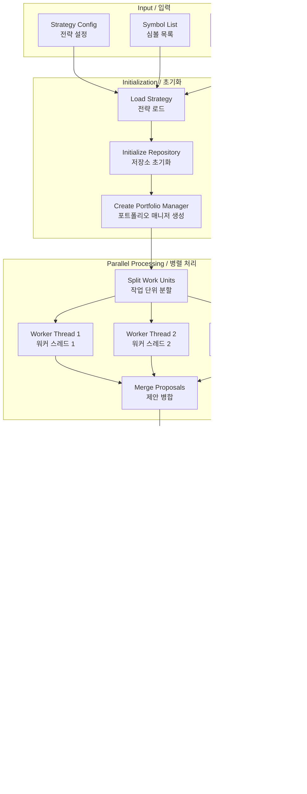

# Architecture Documentation / 아키텍처 문서

## 프로젝트 개요 / Project Overview

### 한국어
이 문서는 Binance Trading Bot의 시스템 아키텍처를 설명합니다. 이 시스템은 암호화폐 거래 전략을 백테스팅하고 분석하는 고성능 플랫폼입니다. FastAPI, Celery, MongoDB, Docker를 활용하여 분산형 태스크 실행과 샌드박스 환경에서의 안전한 전략 평가를 제공합니다.

### English
This document describes the system architecture of the Binance Trading Bot. This system is a high-performance platform for backtesting and analyzing cryptocurrency trading strategies. It leverages FastAPI, Celery, MongoDB, and Docker to provide distributed task execution and secure strategy evaluation in sandboxed environments.

## 시스템 아키텍처 개요 / System Architecture Overview

### 한국어
시스템은 3계층 아키텍처로 구성되어 있으며, 각 계층은 명확한 책임을 가지고 있습니다:
- **API 계층**: REST 및 GraphQL 엔드포인트 제공
- **서비스 계층**: 비즈니스 로직 오케스트레이션
- **비즈니스 로직 계층**: 샌드박스된 전략 실행

### English
The system consists of a 3-layer architecture, with each layer having clear responsibilities:
- **API Layer**: Provides REST and GraphQL endpoints
- **Service Layer**: Orchestrates business logic
- **Business Logic Layer**: Sandboxed strategy execution

## 기술 스택 / Technology Stack

### 한국어
- **백엔드 프레임워크**: FastAPI (고성능 비동기 웹 프레임워크)
- **태스크 큐**: Celery + Redis (분산 태스크 처리)
- **데이터베이스**: MongoDB (마스터-슬레이브 구조), PostgreSQL
- **컨테이너화**: Docker (전략 샌드박싱)
- **API**: REST + GraphQL
- **실시간 통신**: WebSocket (진행상황 스트리밍)

### English
- **Backend Framework**: FastAPI (high-performance async web framework)
- **Task Queue**: Celery + Redis (distributed task processing)
- **Database**: MongoDB (master-slave configuration), PostgreSQL
- **Containerization**: Docker (strategy sandboxing)
- **API**: REST + GraphQL
- **Real-time Communication**: WebSocket (progress streaming)

## 데이터 흐름 / Data Flow

### 백테스트 실행 흐름 / Backtest Execution Flow

## 데이터베이스 아키텍처 / Database Architecture

### MongoDB 마스터-슬레이브 구조 / MongoDB Master-Slave Configuration

### 데이터 모델 / Data Models

## API 엔드포인트 구조 / API Endpoint Structure

### REST API 엔드포인트 / REST API Endpoints

## Celery 태스크 워크플로우 / Celery Task Workflow

## Docker 샌드박싱 아키텍처 / Docker Sandboxing Architecture

### 한국어
전략 실행은 보안과 격리를 위해 Docker 컨테이너 내에서 이루어집니다. 각 백테스트는 독립된 컨테이너에서 실행되며, 읽기 전용 데이터베이스 접근만 허용됩니다.

### English
Strategy execution occurs within Docker containers for security and isolation. Each backtest runs in an independent container with read-only database access.

## 전략 실행 흐름 / Strategy Execution Flow

## 보안 고려사항 / Security Considerations

### 한국어
1. **샌드박스 실행**: 모든 사용자 전략은 격리된 Docker 컨테이너에서 실행
2. **읽기 전용 접근**: 전략은 데이터베이스에 대해 읽기 권한만 보유
3. **리소스 제한**: 컨테이너는 메모리와 CPU 제한 설정
4. **네트워크 격리**: 컨테이너는 제한된 네트워크 접근만 허용
5. **JWT 인증**: API 접근에 JWT 토큰 기반 인증 사용 가능

### English
1. **Sandboxed Execution**: All user strategies run in isolated Docker containers
2. **Read-Only Access**: Strategies only have read permissions to the database
3. **Resource Limits**: Containers have memory and CPU limits
4. **Network Isolation**: Containers have restricted network access
5. **JWT Authentication**: JWT token-based authentication available for API access

## 배포 아키텍처 / Deployment Architecture

### 한국어
시스템은 Docker Compose를 사용하여 모든 서비스를 오케스트레이션합니다. 개발 환경과 프로덕션 환경 모두를 지원하며, 수평 확장이 가능합니다.

### English
The system uses Docker Compose to orchestrate all services. It supports both development and production environments with horizontal scaling capabilities.

## 주요 설계 결정사항 / Key Design Decisions

### 한국어
1. **Celery 비동기 처리**: 장시간 실행되는 백테스트를 블로킹 없이 처리
2. **MongoDB 마스터-슬레이브**: 읽기/쓰기 분리로 확장성 향상
3. **Docker 샌드박싱**: 전략 실행의 보안성 보장
4. **GraphQL 지원**: 유연한 쿼리 기능 제공
5. **Pydantic 설정 관리**: 타입 안전한 설정 관리

### English
1. **Celery for Async**: Handles long-running backtests without blocking
2. **MongoDB Master-Slave**: Separates read/write concerns for scalability
3. **Docker Sandboxing**: Ensures security for strategy execution
4. **GraphQL Support**: Provides flexible querying capabilities
5. **Pydantic Settings**: Type-safe configuration management

## 일반적인 워크플로우 / Common Workflows

### 백테스트 워크플로우 / Backtesting Workflow

## 향후 고려사항 / Future Considerations

### 한국어
1. **실시간 거래**: 백테스트 결과를 기반으로 한 실시간 거래 기능
2. **머신러닝 통합**: AI/ML 기반 전략 최적화
3. **멀티 익스체인지 지원**: 여러 거래소 데이터 통합
4. **고급 시각화**: 대시보드 및 차트 기능 강화
5. **클라우드 네이티브**: Kubernetes 기반 배포

### English
1. **Live Trading**: Real-time trading based on backtest results
2. **Machine Learning Integration**: AI/ML-based strategy optimization
3. **Multi-Exchange Support**: Integration with multiple exchange data
4. **Advanced Visualization**: Enhanced dashboard and charting features
5. **Cloud Native**: Kubernetes-based deployment

## 결론 / Conclusion

### 한국어
Binance Trading Bot은 확장 가능하고 안전한 암호화폐 거래 전략 백테스팅 플랫폼입니다. 마이크로서비스 아키텍처와 컨테이너 기반 격리를 통해 높은 성능과 보안성을 제공합니다.

### English
The Binance Trading Bot is a scalable and secure cryptocurrency trading strategy backtesting platform. It provides high performance and security through microservices architecture and container-based isolation.
