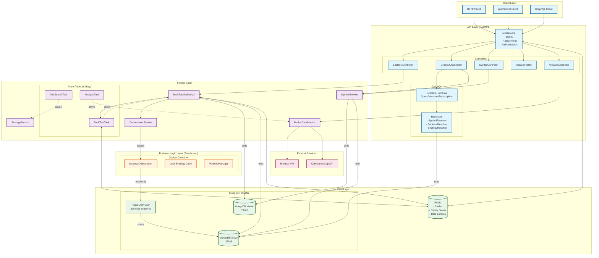
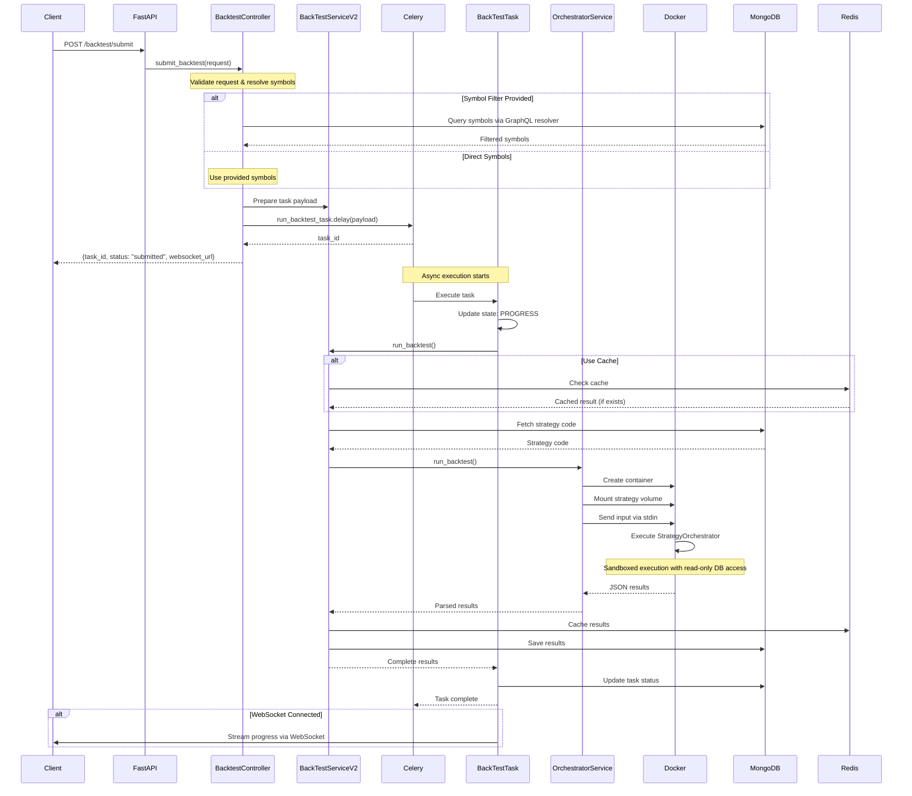
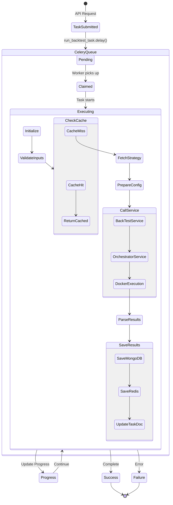
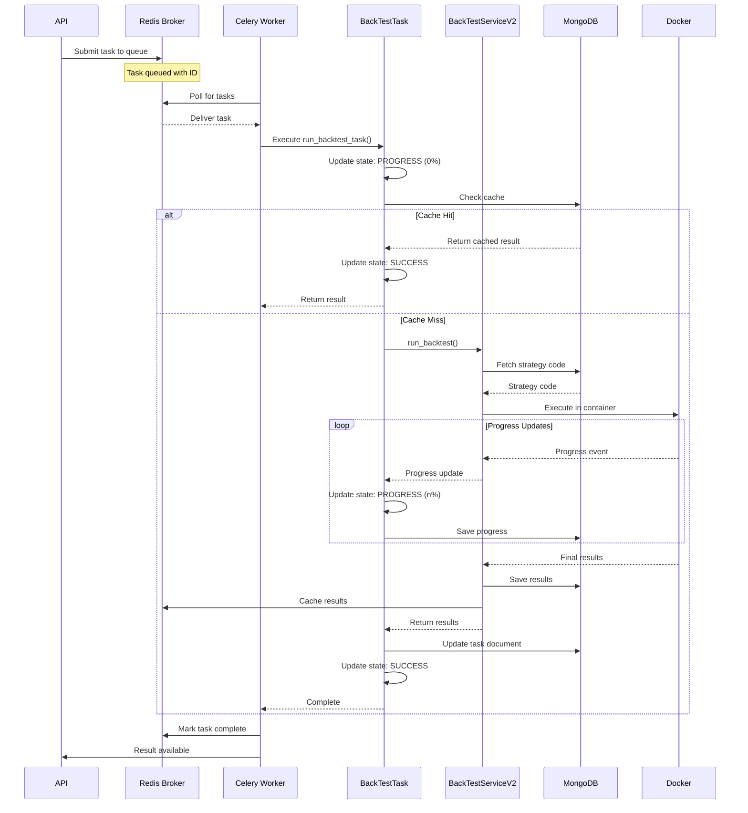
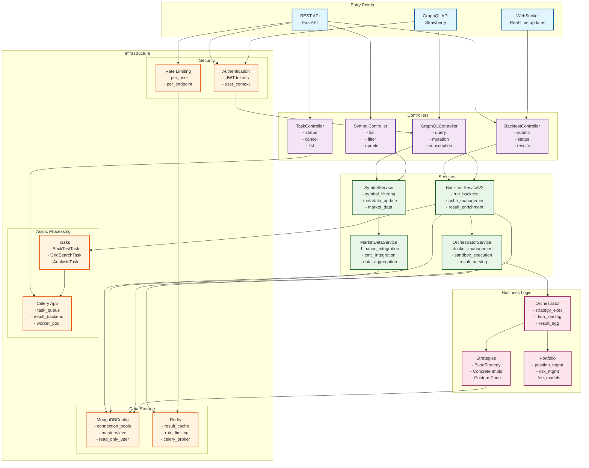

# Binance Trading Bot Architecture Diagrams

## 1. System Architecture Overview



## 2. BacktestController Request Flow



## 3. GraphQL Request Flow

```mermaid
graph LR
    subgraph "Client Request"
        Query[GraphQL Query<br/>```<br/>query {<br/>  symbols(filter: {<br/>    marketCapMin: 1M<br/>  }) {<br/>    symbol<br/>    name<br/>  }<br/>}<br/>```]
    end
    
    subgraph "FastAPI Layer"
        GQLRouter[GraphQL Router<br/>Strawberry]
        Context[Context Builder<br/>- Request<br/>- User Auth]
    end
    
    subgraph "Schema Layer"
        Schema[GraphQL Schema<br/>@strawberry.type]
        QueryType[Query Type<br/>- symbols()<br/>- strategies()<br/>- backtestResults()]
        MutationType[Mutation Type<br/>- createStrategy()<br/>- updateMetadata()]
        SubType[Subscription Type<br/>- symbolUpdates()<br/>- backtestProgress()]
    end
    
    subgraph "Resolver Layer"
        SR[SymbolResolver]
        BR[BacktestResolver]
        STR[StrategyResolver]
        MR[MarketResolver]
    end
    
    subgraph "Data Access"
        MongoSlave[(MongoDB Slave<br/>Read Operations)]
        MongoMaster[(MongoDB Master<br/>Write Operations)]
        RedisCache[(Redis Cache)]
    end
    
    Query --> GQLRouter
    GQLRouter --> Context
    Context --> Schema
    Schema --> QueryType
    Schema --> MutationType
    Schema --> SubType
    
    QueryType --> SR
    QueryType --> BR
    QueryType --> STR
    QueryType --> MR
    
    MutationType --> STR
    MutationType --> SR
    
    SubType --> SR
    SubType --> BR
    
    SR -->|read| MongoSlave
    BR -->|read| MongoSlave
    STR -->|read| MongoSlave
    MR -->|read| MongoSlave
    
    SR -->|write| MongoMaster
    STR -->|write| MongoMaster
    
    SR <--> RedisCache
    BR <--> RedisCache
    
    style Query fill:#e3f2fd
    style Schema fill:#f3e5f5
    style SR fill:#e8f5e9
    style MongoSlave fill:#fff3e0
    style RedisCache fill:#ffebee
```

## 4. Database Architecture

```mermaid
graph TB
    subgraph "MongoDB Architecture"
        subgraph "Primary (Master)"
            Master[(MongoDB Master<br/>:27017<br/>Primary)]
            
            subgraph "Master Databases"
                MDB1[trading DB]
                MDB2[ohlcv DB]
                MDB3[perp DB]
            end
            
            subgraph "Collections"
                C1[symbols]
                C2[backtest_results]
                C3[strategies]
                C4[tasks]
                C5[candles]
                C6[trades]
            end
        end
        
        subgraph "Secondary (Slave)"
            Slave[(MongoDB Slave<br/>:27018<br/>Secondary)]
            
            subgraph "Slave Databases"
                SDB1[trading DB<br/>(replica)]
                SDB2[ohlcv DB<br/>(replica)]
                SDB3[perp DB<br/>(replica)]
            end
        end
        
        subgraph "Users & Permissions"
            Admin[Admin User<br/>Full Access]
            RO[backtest_readonly<br/>Read-Only User]
            App[App User<br/>Read/Write]
        end
    end
    
    subgraph "Connection Management"
        MCC[MongoDBConfig Class]
        
        subgraph "Connection Pools"
            MASync[Master Async<br/>Motor Client]
            MSync[Master Sync<br/>PyMongo Client]
            SSync[Slave Sync<br/>Secondary Preferred]
        end
        
        subgraph "URIs"
            MURI[Master URI<br/>mongodb://localhost:27017]
            SURI[Slave URI<br/>mongodb://localhost:27018]
            ROURI[Read-Only URI<br/>mongodb://backtest_readonly@...]
        end
    end
    
    subgraph "Access Patterns"
        Write[Write Operations<br/>- Create backtest<br/>- Save results<br/>- Update symbols]
        Read[Read Operations<br/>- Query symbols<br/>- Fetch strategies<br/>- Get results]
        Sandbox[Sandboxed Read<br/>- Strategy execution<br/>- Market data fetch]
    end
    
    Master --> MDB1
    Master --> MDB2
    Master --> MDB3
    
    MDB1 --> C1
    MDB1 --> C2
    MDB1 --> C3
    MDB1 --> C4
    MDB2 --> C5
    MDB1 --> C6
    
    Master -.->|Replication| Slave
    Slave --> SDB1
    Slave --> SDB2
    Slave --> SDB3
    
    Admin --> Master
    App --> Master
    App --> Slave
    RO --> Slave
    
    MCC --> MASync
    MCC --> MSync
    MCC --> SSync
    
    MASync --> MURI
    MSync --> MURI
    SSync --> SURI
    RO --> ROURI
    
    Write --> Master
    Read --> Slave
    Sandbox --> RO
    
    classDef primary fill:#bbdefb,stroke:#1565c0,stroke-width:2px
    classDef secondary fill:#c8e6c9,stroke:#2e7d32,stroke-width:2px
    classDef config fill:#fff9c4,stroke:#f57f17,stroke-width:2px
    classDef access fill:#ffccbc,stroke:#d84315,stroke-width:2px
    
    class Master,MDB1,MDB2,MDB3,C1,C2,C3,C4,C5,C6 primary
    class Slave,SDB1,SDB2,SDB3 secondary
    class MCC,MASync,MSync,SSync,MURI,SURI,ROURI config
    class Write,Read,Sandbox access
```

## 5. Celery Task Flow





## 6. Docker Sandboxing Architecture

```mermaid
graph TB
    subgraph "Host System"
        subgraph "OrchestratorService"
            OS[OrchestratorService]
            TP[Thread Pool<br/>max_workers=5]
            TC[Temp Directory<br/>Strategy Code]
        end
        
        subgraph "Docker Daemon"
            DM[Docker Manager]
            IMG[Orchestrator Image<br/>tradingbot_orchestrator:latest]
        end
    end
    
    subgraph "Sandboxed Container"
        subgraph "Container Config"
            ENV[Environment<br/>- MONGO_URI (read-only)<br/>- RUN_ID<br/>- PYTHONUNBUFFERED=1]
            RES[Resources<br/>- Memory: 2GB<br/>- CPU: 100%<br/>- Auto-remove: true]
            VOL[Volume Mount<br/>user_strategy.py (read-only)]
        end
        
        subgraph "Execution Environment"
            SO[StrategyOrchestrator.py]
            US[User Strategy Code]
            PM[PortfolioManager]
            DM2[DataManager]
        end
        
        subgraph "Permissions"
            RO[Read-Only DB Access<br/>backtest_readonly user]
            NW[No Network<br/>(except MongoDB)]
            FS[No Host Filesystem<br/>(except mounted strategy)]
        end
    end
    
    subgraph "Data Flow"
        Input[Input Config<br/>(via stdin)]
        Output[JSON Results<br/>(via stdout)]
        Logs[Logs<br/>(stdout/stderr)]
    end
    
    OS --> TP
    TP --> TC
    TC --> |Create strategy.py| VOL
    
    OS --> DM
    DM --> IMG
    IMG --> |Create container| ENV
    
    ENV --> SO
    VOL --> US
    SO --> US
    SO --> PM
    SO --> DM2
    
    DM2 --> RO
    RO --> |Query only| MongoDB[(MongoDB Slave)]
    
    OS --> |Send config| Input
    Input --> SO
    SO --> Output
    SO --> Logs
    Output --> OS
    Logs --> OS
    
    style OS fill:#e1f5fe
    style SO fill:#fff3e0
    style RO fill:#ffcdd2
    style MongoDB fill:#c8e6c9
    
    classDef host fill:#e3f2fd,stroke:#1565c0,stroke-width:2px
    classDef sandbox fill:#fff3e0,stroke:#ef6c00,stroke-width:2px
    classDef security fill:#ffebee,stroke:#c62828,stroke-width:2px
    
    class OS,TP,TC,DM,IMG host
    class ENV,RES,VOL,SO,US,PM,DM2 sandbox
    class RO,NW,FS security
```

## 7. Component Interaction Diagram



## Key Architectural Patterns

### 1. **Three-Layer Architecture**
- **API Layer**: FastAPI controllers handle HTTP/WebSocket/GraphQL requests
- **Service Layer**: Business logic orchestration, async task management
- **Business Logic Layer**: Sandboxed strategy execution in Docker containers

### 2. **Async Processing**
- Celery for long-running backtests
- Progress tracking via task state updates
- WebSocket streaming for real-time updates

### 3. **Data Access Patterns**
- **Master MongoDB**: All write operations
- **Slave MongoDB**: Read operations (secondary preferred)
- **Read-Only User**: Sandboxed containers get limited access
- **Redis Cache**: Result caching with TTL

### 4. **Security Boundaries**
- Docker containers with resource limits (2GB RAM, 100% CPU)
- Read-only database access for strategies
- No network access except MongoDB
- Volume mount for strategy code (read-only)

### 5. **Scalability Features**
- Connection pooling for MongoDB
- Thread pool for concurrent Docker executions
- Distributed task queue with Celery
- Master-slave database separation

### 6. **GraphQL Integration**
- Flexible querying with Strawberry
- Resolvers use slave MongoDB for reads
- Subscriptions for real-time updates
- Type-safe schema with Pydantic models

This architecture ensures security through sandboxing, scalability through distributed processing, and flexibility through GraphQL and pluggable strategies.