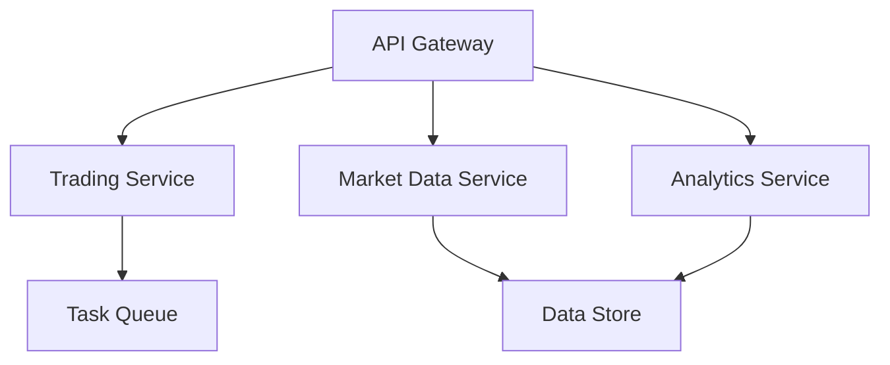

# 바이낸스 트레이딩 봇 심층 코드 검증 리포트
# Binance Trading Bot - Comprehensive Code Review Report

## Executive Summary

이 리포트는 바이낸스 트레이딩 봇 코드베이스의 심층 분석 결과를 담고 있습니다. 분석 결과, 프로덕션 환경에서 사용하기 전에 반드시 해결해야 할 중대한 보안, 안정성, 성능 문제들이 발견되었습니다.

**심각도 분류:**
- 🔴 **Critical**: 즉시 수정 필요 (시스템 크래시, 데이터 손실, 보안 취약점)
- 🟡 **High**: 높은 우선순위 (잘못된 결과, 성능 문제)
- 🔵 **Medium**: 중간 우선순위 (코드 품질, 유지보수성)

---

## 1. 핵심 아키텍처 문제점

### 🔴 데이터베이스 연결 관리
**문제점:**
- 글로벌 변수로 DB 연결을 초기화하여 메모리 누수 위험
- 연결 풀링 미구성으로 리소스 고갈 가능성
- 재시도 로직 부재로 일시적 네트워크 문제 시 서비스 중단

**예시 (db.py):**
```python
# 현재 코드 - 위험
mongo_client = AsyncIOMotorClient(settings.MONGO_URI) if settings.MONGO_URI else None

# 개선안
class DatabaseManager:
    def __init__(self):
        self.mongo_client = None
        
    async def connect(self):
        self.mongo_client = AsyncIOMotorClient(
            settings.MONGO_URI,
            maxPoolSize=50,
            minPoolSize=10,
            serverSelectionTimeoutMS=5000
        )
```

### 🔴 보안 취약점
**발견된 보안 문제:**
1. **인증/인가 부재**: 모든 API 엔드포인트가 공개 접근 가능
2. **API 키 노출**: 사용자가 제공한 API 키가 로그에 기록될 수 있음
3. **SQL 인젝션 위험**: StrategyController에서 문자열 포맷팅으로 SQL 쿼리 생성
4. **하드코딩된 인증정보**: docker-compose.yml에 postgres:postgres

### 🟡 시작/종료 프로세스
**문제점:**
- DB 연결 실패 시에도 애플리케이션이 계속 실행됨
- Graceful shutdown 미구현으로 진행 중인 작업 손실 가능
- 헬스체크 엔드포인트 부재

---

## 2. API 레이어 검증 결과

### 🔴 입력 검증 부재
**영향받는 컨트롤러:**
- `BacktestController`: timeframe, add_buy_pct 등 검증 없음
- `GridSearchController`: num_iterations 상한선 없어 DoS 공격 가능
- `SymbolController`: max_pages 무제한으로 설정 가능

**개선 예시:**
```python
class BacktestRequest(BaseModel):
    timeframe: Literal["1m", "5m", "15m", "30m", "1h", "4h", "1d"]
    add_buy_pct: float = Field(ge=0, le=100)
    
    @validator('start_date')
    def validate_date(cls, v):
        try:
            datetime.strptime(v, "%Y-%m-%d")
        except ValueError:
            raise ValueError("Date must be YYYY-MM-DD format")
        return v
```

### 🟡 RESTful 설계 문제
- 일관성 없는 라우트 명명 규칙
- HTTP 메서드 활용 미흡 (GET/POST/PUT/DELETE)
- 리소스 중심이 아닌 액션 중심 설계

### 🟡 에러 처리
- 일반적인 Exception만 캐치하여 디버깅 어려움
- 클라이언트에게 내부 오류 정보 노출
- 일관성 없는 HTTP 상태 코드 사용

---

## 3. Celery 태스크 시스템 문제점

### 🔴 타임아웃 미설정
**문제점:**
- 모든 태스크에 `time_limit` 설정 없음
- 무한 루프나 외부 API 지연 시 워커 행 걸림

**개선안:**
```python
@celery.task(bind=True, time_limit=300, soft_time_limit=240)
def backtest_task(self, request_data):
    try:
        # 태스크 로직
    except SoftTimeLimitExceeded:
        # Graceful cleanup
        return {"status": "timeout"}
```

### 🟡 재시도 로직 부재
- 일시적 네트워크 오류 시 태스크 실패
- 외부 API 요청 실패 시 복구 불가능

### 🟡 진행 상황 추적 없음
- 장시간 실행 태스크의 진행률 확인 불가
- 사용자 경험 저하

---

## 4. 데이터 레이어 분석

### 🔴 연결 누수
**문제점:**
- `CandleRepository`, `MongoFundingProvider`가 새 MongoClient 생성 후 닫지 않음
- 장시간 실행 시 연결 고갈

### 🔴 트랜잭션 부재
- 복수 DB 작업 시 일관성 보장 안됨
- 부분 실패 시 데이터 불일치 발생 가능

### 🟡 N+1 쿼리 문제
**위치:** `fetch_candles()`
```python
# 현재 - 비효율적
for doc in documents:
    coll.update_one(filter, {"$set": doc}, upsert=True)

# 개선안 - 벌크 연산
operations = [UpdateOne(filter, {"$set": doc}, upsert=True) for doc in documents]
coll.bulk_write(operations)
```

### 🟡 캐시 관리
- 메모리 캐시 크기 제한 없음
- 캐시 무효화 전략 부재

---

## 5. 비즈니스 로직 버그

### 🔴 Import 경로 오류
**위치:** `TradeProposal.py`
```python
# 잘못된 상대 경로
from TradeEvent import TradeEvent

# 수정 필요
from entities.tradeManager.TradeEvent import TradeEvent
```

### 🔴 Funding Rate 로직 오류
**위치:** `PerpPortfolioManager._apply_funding()`
```python
# 현재 - 반대로 동작
if not spec or ts % spec.funding_intvl:
    return

# 수정안
if not spec or (ts % spec.funding_intvl) != 0:
    return
```

### 🟡 부동소수점 정밀도
- 금융 계산에 float 사용으로 오차 누적
- Decimal 타입 사용 권장

### 🟡 스레드 안전성
- 동시 실행 시 레이스 컨디션 발생 가능
- 락이나 동기화 메커니즘 부재

---

## 6. 에러 처리 및 엣지 케이스

### 🔴 0으로 나누기
**발견 위치:**
- `BasePortfolioManager._cash_ok()`: entry_px가 0일 때
- `Position.avg_px` 계산: qty가 0일 때
- `analytics.sharpe_ratio()`: 표준편차가 0일 때

### 🔴 리소스 고갈 시나리오
- 전역 타임라인 생성 시 메모리 제한 없음
- 대량 심볼 처리 시 OOM 가능

### 🟡 네트워크 실패 처리
- 지수 백오프에 상한선 없음 (최대 2^7 = 128초 대기)
- 서킷 브레이커 패턴 미구현

---

## 7. 우선순위별 개선 사항

### 즉시 수정 필요 (1주일 내)
1. **인증/인가 구현**
   ```python
   from fastapi_security import HTTPBearer
   security = HTTPBearer()
   
   @router.post("/backtest")
   async def backtest(
       request: BacktestRequest,
       credentials: HTTPAuthorizationCredentials = Depends(security)
   ):
       # 토큰 검증 로직
   ```

2. **입력 검증 추가**
   - 모든 API 엔드포인트에 Pydantic 모델 적용
   - 범위 검증, 타입 검증 구현

3. **데이터베이스 연결 풀링**
   - 모든 DB 클라이언트에 연결 풀 설정
   - 헬스체크 및 재연결 로직 구현

4. **Import 경로 수정**
   - TradeProposal.py의 상대 경로를 절대 경로로 변경

5. **0으로 나누기 방지**
   - 모든 나눗셈 연산 전 검증 추가

### 높은 우선순위 (2주일 내)
1. **Celery 태스크 개선**
   - 타임아웃 설정
   - 재시도 로직 구현
   - 진행률 추적 추가

2. **에러 처리 표준화**
   - 전역 예외 핸들러 구현
   - 구조화된 에러 응답 포맷

3. **리소스 제한**
   - 메모리 캐시 크기 제한
   - 동시 실행 태스크 수 제한

4. **로깅 개선**
   - 민감한 정보 필터링
   - 구조화된 로그 포맷

### 중간 우선순위 (1개월 내)
1. **테스트 커버리지**
   - 단위 테스트 작성
   - 통합 테스트 구현
   - 부하 테스트 수행

2. **모니터링 구현**
   - 메트릭 수집
   - 알람 설정
   - 대시보드 구성

3. **문서화**
   - API 문서 자동 생성
   - 개발자 가이드 작성
   - 운영 매뉴얼 작성

---

## 8. 아키텍처 개선 제안

### 마이크로서비스 분리


### 이벤트 소싱 패턴
- 모든 거래 이벤트를 불변 로그로 저장
- 상태 재구성 가능
- 감사 추적 용이

### CQRS 패턴
- 읽기/쓰기 분리
- 성능 최적화
- 확장성 개선

---

## 9. 문제점 간의 상호 연관성

### 연쇄 실패 시나리오
1. **DB 연결 풀 고갈** → **Celery 태스크 실패** → **사용자 요청 타임아웃**
2. **입력 검증 부재** → **잘못된 데이터 저장** → **비즈니스 로직 오류** → **잘못된 거래 신호**
3. **메모리 누수** → **워커 크래시** → **태스크 손실** → **데이터 불일치**

### 보안 취약점 연쇄
- API 인증 부재 + 입력 검증 부재 + 리소스 제한 없음 = **완전한 시스템 장악 가능**

### 데이터 무결성 위험
- 트랜잭션 부재 + 에러 처리 미흡 + 동시성 제어 없음 = **데이터 손상 위험**

---

## 결론

현재 코드베이스는 MVP 수준으로 핵심 기능은 동작하지만, 프로덕션 환경에서 사용하기에는 심각한 문제들이 있습니다. 특히 보안, 안정성, 확장성 측면에서 즉각적인 개선이 필요합니다.

**주요 리스크:**
- 🔴 **보안**: 인증 없는 API로 인한 시스템 침해 위험
- 🔴 **안정성**: 리소스 관리 실패로 인한 서비스 중단 위험
- 🔴 **정확성**: 계산 오류 및 로직 버그로 인한 재무 손실 위험

**권장 사항:**
1. Critical 이슈들을 먼저 해결 (특히 보안 및 리소스 관리)
2. 포괄적인 테스트 스위트 구축
3. 단계적 리팩토링 진행
4. 프로덕션 배포 전 보안 감사 수행
5. 실시간 모니터링 시스템 구축

이 리포트가 코드 품질 개선의 로드맵이 되기를 바랍니다. 각 문제점들은 독립적으로 보이지만 서로 연결되어 있으므로, 체계적이고 종합적인 접근이 필요합니다.