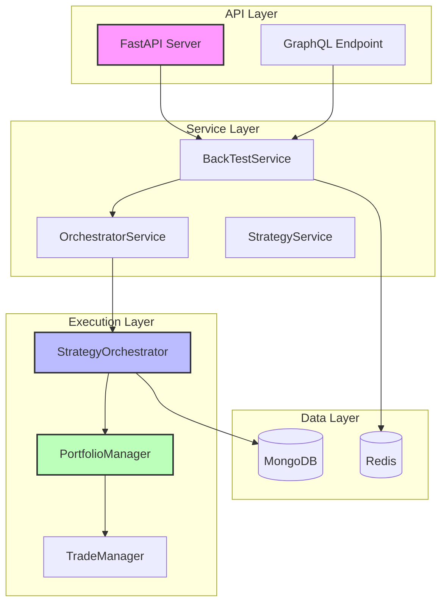
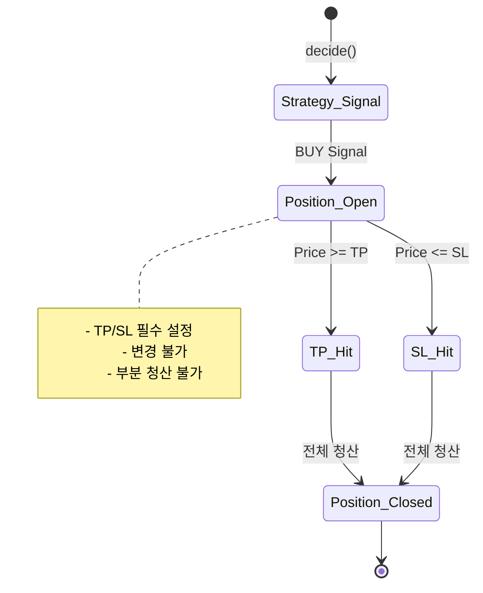
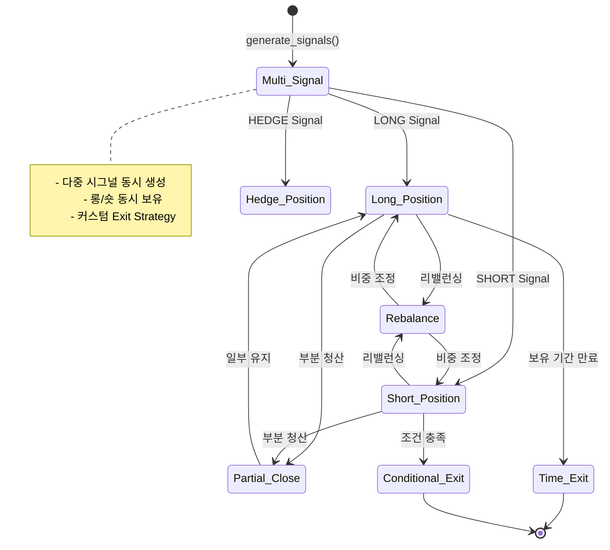
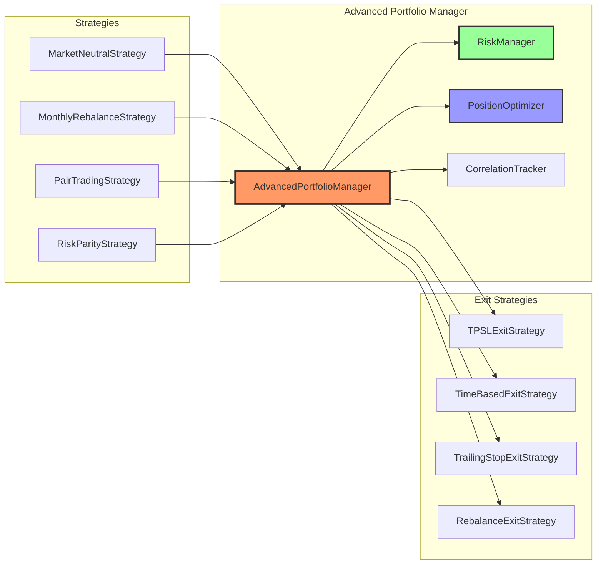
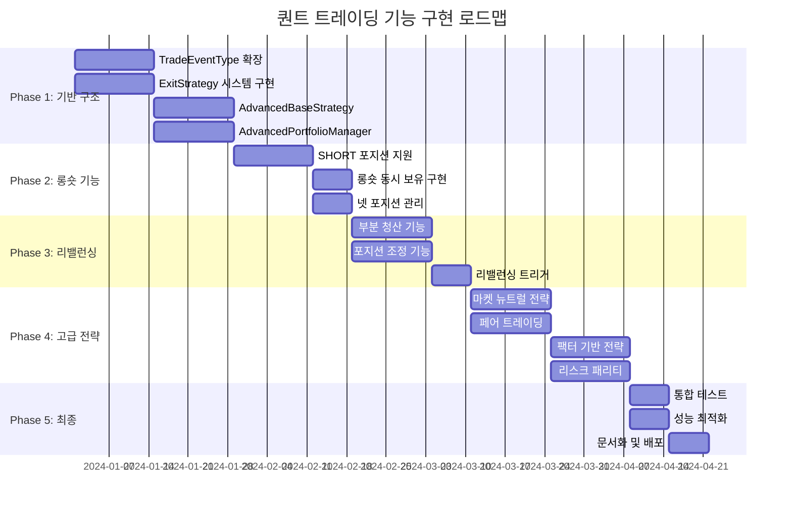
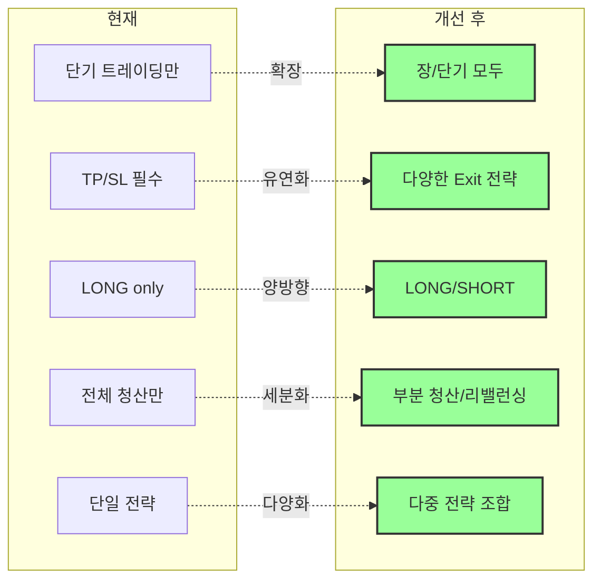

# 바이낸스 트레이딩 봇 퀀트 투자 기능 확장 개발 제안서

## 1. 개요

현재 바이낸스 트레이딩 봇은 단기 트레이딩 전략에 최적화되어 있으며, TP/SL 기반의 단순한 포지션 관리만을 지원합니다. 본 제안서는 퀀트 투자의 핵심 기능들을 구현하기 위한 구체적인 개선 방안을 제시합니다.

### 현재 시스템 아키텍처


## 2. 현재 시스템의 구조적 한계

### 2.1 포지션 라이프사이클의 경직성
```python
# 현재: strategyOrchestrator/entities/tradeManager/TradeProposal.py:86-108
# 문제: TP/SL 도달 시 무조건 전체 청산
for _, candle in df[idx:].iterrows():
    hit = self._check_exit(candle, tp_px, sl_px)
    if hit:
        self._events.append(TradeEvent(...))  # 전체 포지션 청산
        break
```

### 2.2 전략 인터페이스의 제약
```python
# 현재: BaseStrategy.decide() 메서드의 반환값
{
    "signal": "BUY",  # BUY만 가능, SHORT 불가
    "tp_price": float,  # 필수
    "sl_price": float,  # 필수
    "direction": "LONG"  # LONG만 지원
}
```

### 2.3 포트폴리오 매니저의 한계
- 동시 보유 포지션 수 제한 (capacity_policy)
- 포지션 간 상관관계 미고려
- 헤지 전략 불가능

### 현재 포지션 라이프사이클


## 3. 퀀트 투자 기능 요구사항

### 3.1 핵심 기능
1. **롱/숏 전략**: 양방향 포지션 지원
2. **포트폴리오 리밸런싱**: 주기적 비중 조정
3. **페어 트레이딩**: 상관 자산 간 스프레드 거래
4. **리스크 패리티**: 변동성 기반 자산 배분
5. **팩터 투자**: 모멘텀, 밸류, 퀄리티 등 팩터 기반 전략

### 3.2 리스크 관리
1. **동적 헤징**: 시장 상황에 따른 헤지 비율 조정
2. **포지션 사이징**: 켈리 공식, 리스크 패리티 등
3. **상관관계 분석**: 포트폴리오 분산 효과 극대화

## 4. 구체적 개선 방안

### 4.1 TradeEvent 시스템 확장

#### 현재 구조
```python
# strategyOrchestrator/entities/tradeManager/TradeEventType.py
class TradeEventType(Enum):
    OPEN = "OPEN"
    CLOSE = "CLOSE"
```

#### 개선안
```python
class TradeEventType(Enum):
    OPEN = "OPEN"
    CLOSE = "CLOSE"
    PARTIAL_CLOSE = "PARTIAL_CLOSE"  # 부분 청산
    REBALANCE = "REBALANCE"  # 리밸런싱
    HEDGE = "HEDGE"  # 헤지 포지션
    TIME_EXIT = "TIME_EXIT"  # 시간 기반 청산
    CONDITIONAL_EXIT = "CONDITIONAL_EXIT"  # 조건부 청산
```

#### 개선된 포지션 라이프사이클


### 4.2 BaseStrategy 인터페이스 재설계

#### 새로운 전략 베이스 클래스
```python
# entities/strategies/AdvancedBaseStrategy.py
class AdvancedBaseStrategy(BaseStrategy):
    def decide(self, df: pd.DataFrame, interval: str, **kwargs) -> Dict[str, Any]:
        """기존 인터페이스 유지"""
        return self.generate_signals(df, interval, **kwargs)
    
    def generate_signals(self, df: pd.DataFrame, interval: str, **kwargs) -> Dict[str, Any]:
        """다중 시그널 생성"""
        signals = []
        
        # 롱/숏 동시 포지션 가능
        if self.check_long_condition(df):
            signals.append(self._create_long_signal(df, **kwargs))
        
        if self.check_short_condition(df):
            signals.append(self._create_short_signal(df, **kwargs))
        
        # 리밸런싱 시그널
        if self.check_rebalance_condition(df):
            signals.extend(self._create_rebalance_signals(df, **kwargs))
        
        return {"signals": signals, "type": "multi"}
    
    def get_exit_strategy(self) -> ExitStrategy:
        """커스텀 청산 전략 반환"""
        return self.exit_strategy or DefaultExitStrategy()
```

### 4.3 ExitStrategy 시스템 도입

#### 청산 전략 인터페이스
```python
# entities/strategies/exit/ExitStrategy.py
class ExitStrategy(ABC):
    @abstractmethod
    def should_exit(self, position: Position, market_data: pd.DataFrame) -> Optional[ExitSignal]:
        pass

class TPSLExitStrategy(ExitStrategy):
    """기존 TP/SL 로직"""
    
class TimeBasedExitStrategy(ExitStrategy):
    """보유 기간 기반 청산"""
    
class RebalanceExitStrategy(ExitStrategy):
    """리밸런싱을 위한 부분 청산"""
    
class TrailingStopExitStrategy(ExitStrategy):
    """트레일링 스탑"""
```

### 4.4 포트폴리오 매니저 확장

#### 포트폴리오 관리 시스템 아키텍처


#### 현재 구조 개선
```python
# entities/portfolio/AdvancedPortfolioManager.py
class AdvancedPortfolioManager(BasePortfolioManager):
    def __init__(self, **kwargs):
        super().__init__(**kwargs)
        self.risk_manager = RiskManager()
        self.position_optimizer = PositionOptimizer()
        self.correlation_tracker = CorrelationTracker()
    
    def try_execute(self, proposal: TradeProposal, **kwargs) -> bool:
        # 리스크 체크 강화
        if not self.risk_manager.check_portfolio_risk(proposal, self.get_positions()):
            return False
        
        # 포지션 최적화
        adjusted_proposal = self.position_optimizer.optimize(proposal, self.get_positions())
        
        return super().try_execute(adjusted_proposal, **kwargs)
    
    def rebalance(self, target_weights: Dict[str, float], current_prices: Dict[str, float]):
        """포트폴리오 리밸런싱"""
        current_weights = self._calculate_current_weights(current_prices)
        rebalance_orders = self._generate_rebalance_orders(current_weights, target_weights)
        
        for order in rebalance_orders:
            self._execute_rebalance_order(order)
```

### 4.5 새로운 전략 구현 예시

#### 롱숏 마켓 뉴트럴 전략
```python
# entities/strategies/concreteStrategies/MarketNeutralStrategy.py
class MarketNeutralStrategy(AdvancedBaseStrategy):
    def __init__(self, **kwargs):
        super().__init__(**kwargs)
        self.long_ratio = kwargs.get('long_ratio', 0.5)
        self.short_ratio = kwargs.get('short_ratio', 0.5)
        self.rebalance_threshold = kwargs.get('rebalance_threshold', 0.1)
    
    def generate_signals(self, df: pd.DataFrame, interval: str, **kwargs):
        signals = []
        
        # 상위 모멘텀 종목 롱
        top_momentum = self._identify_top_momentum(df)
        for symbol in top_momentum:
            signals.append({
                "symbol": symbol,
                "direction": "LONG",
                "signal": "OPEN",
                "size_pct": self.long_ratio / len(top_momentum),
                "exit_strategy": "rebalance"
            })
        
        # 하위 모멘텀 종목 숏
        bottom_momentum = self._identify_bottom_momentum(df)
        for symbol in bottom_momentum:
            signals.append({
                "symbol": symbol,
                "direction": "SHORT",
                "signal": "OPEN",
                "size_pct": self.short_ratio / len(bottom_momentum),
                "exit_strategy": "rebalance"
            })
        
        return {"signals": signals, "type": "market_neutral"}
```

#### 월간 리밸런싱 전략
```python
# entities/strategies/concreteStrategies/MonthlyRebalanceStrategy.py
class MonthlyRebalanceStrategy(AdvancedBaseStrategy):
    def __init__(self, **kwargs):
        super().__init__(**kwargs)
        self.target_weights = kwargs.get('target_weights', {})
        self.rebalance_day = kwargs.get('rebalance_day', 1)  # 매월 1일
    
    def check_rebalance_condition(self, df: pd.DataFrame) -> bool:
        current_date = pd.to_datetime(df.index[-1])
        return current_date.day == self.rebalance_day
    
    def _create_rebalance_signals(self, df: pd.DataFrame, **kwargs):
        signals = []
        current_positions = kwargs.get('current_positions', {})
        current_prices = self._get_current_prices(df)
        
        # 현재 비중 계산
        current_weights = self._calculate_weights(current_positions, current_prices)
        
        # 목표 비중과의 차이 계산
        for symbol, target_weight in self.target_weights.items():
            current_weight = current_weights.get(symbol, 0)
            diff = target_weight - current_weight
            
            if abs(diff) > 0.01:  # 1% 이상 차이날 때만 리밸런싱
                signals.append({
                    "symbol": symbol,
                    "signal": "REBALANCE",
                    "target_weight": target_weight,
                    "current_weight": current_weight,
                    "action": "BUY" if diff > 0 else "SELL",
                    "size_pct": abs(diff)
                })
        
        return signals
```

### 4.6 StrategyOrchestrator 개선

#### 현재 구조
```python
# StrategyOrchestrator.py:134-184 (_proposals_for_job)
# 문제: BUY 시그널과 TP/SL만 처리
```

#### 개선안
```python
def _proposals_for_job_advanced(
    job: dict[str, Any],
    interval: str,
    repo: CandleRepository,
    strategy: BaseStrategy,
    lookback: int,
    num_iter: int,
    portfolio_state: PortfolioState,  # 새로 추가
) -> list:
    """다중 시그널 및 포트폴리오 상태 고려"""
    symbols = job["symbols"]
    merged = _merge_symbol_frames(repo, symbols, interval, num_iter + lookback + 20, lookback)
    
    proposals = []
    for i in range(len(merged) - 1, -1, -1):
        window = merged.iloc[max(0, i - lookback + 1): i + 1]
        
        # 포트폴리오 상태 전달
        decision = strategy.decide(
            window, 
            interval, 
            portfolio_state=portfolio_state,
            current_positions=portfolio_state.positions
        )
        
        # 다중 시그널 처리
        if decision.get("type") == "multi":
            for signal in decision.get("signals", []):
                proposal = self._build_proposal_from_signal(signal, window)
                if proposal:
                    proposals.append(proposal)
        else:
            # 기존 단일 시그널 처리 (하위 호환성)
            if decision.get("signal") == "BUY":
                proposals.append(self._build_legacy_proposal(decision, window))
    
    return proposals
```

## 5. 구현 로드맵



### Phase 1: 기반 구조 개선 (4주)
1. **주 1-2**: TradeEventType 확장 및 ExitStrategy 시스템 구현
2. **주 3-4**: AdvancedBaseStrategy 및 AdvancedPortfolioManager 구현

### Phase 2: 롱숏 기능 구현 (3주)
1. **주 5-6**: SHORT 포지션 지원 추가
2. **주 7**: 롱숏 동시 보유 및 넷 포지션 관리

### Phase 3: 리밸런싱 기능 (3주)
1. **주 8-9**: 부분 청산 및 포지션 조정 기능
2. **주 10**: 시간/조건 기반 리밸런싱 트리거

### Phase 4: 고급 전략 구현 (4주)
1. **주 11-12**: 마켓 뉴트럴, 페어 트레이딩 전략
2. **주 13-14**: 팩터 기반 전략 및 리스크 패리티

### Phase 5: 테스트 및 최적화 (2주)
1. **주 15**: 통합 테스트 및 성능 최적화
2. **주 16**: 문서화 및 배포 준비

## 6. 기술적 고려사항

### 6.1 하위 호환성
- 기존 전략들이 계속 작동하도록 BaseStrategy 인터페이스 유지
- decide() 메서드의 기존 반환 형식 지원

### 6.2 성능 최적화
- 대량의 포지션 처리를 위한 벡터화 연산
- 리밸런싱 시 최소 거래 횟수 계산 알고리즘

### 6.3 리스크 관리
- 포지션 간 상관관계 실시간 모니터링
- 극단적 시장 상황 대응 회로차단기

## 7. 예상 효과

### 개선 전후 비교


1. **전략 다양성**: 단순 방향성 베팅에서 복잡한 헤지 전략까지 구현 가능
2. **리스크 감소**: 마켓 뉴트럴, 페어 트레이딩 등으로 시장 리스크 헤지
3. **수익 안정성**: 장기 투자 및 리밸런싱으로 안정적 수익 추구
4. **확장성**: 새로운 퀀트 전략을 쉽게 추가할 수 있는 구조

## 8. 결론

본 개선안은 현재의 단기 트레이딩 중심 시스템을 종합적인 퀀트 투자 플랫폼으로 진화시킵니다. 기존 코드베이스의 장점을 유지하면서도, 현대적인 퀀트 투자 전략들을 구현할 수 있는 유연한 구조를 제공합니다.

구현 시 가장 중요한 것은 **단계적 접근**입니다. 각 Phase별로 충분한 테스트를 거쳐 안정성을 확보하며, 기존 사용자들이 혼란 없이 새 기능을 사용할 수 있도록 해야 합니다.
