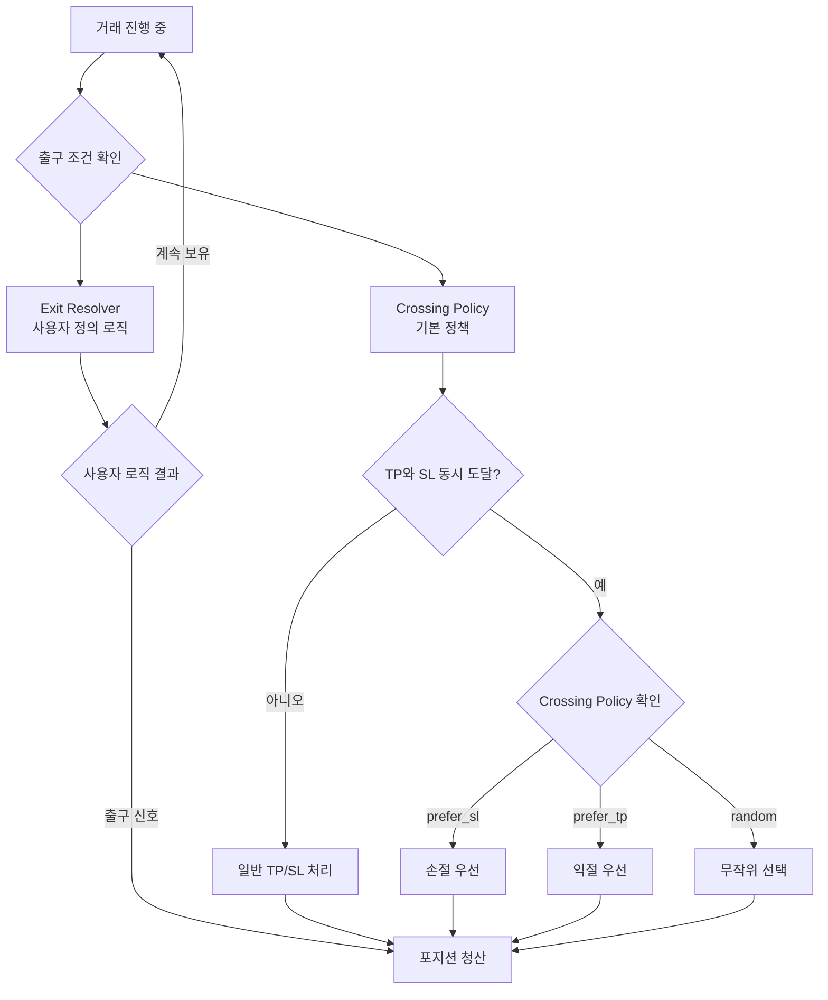
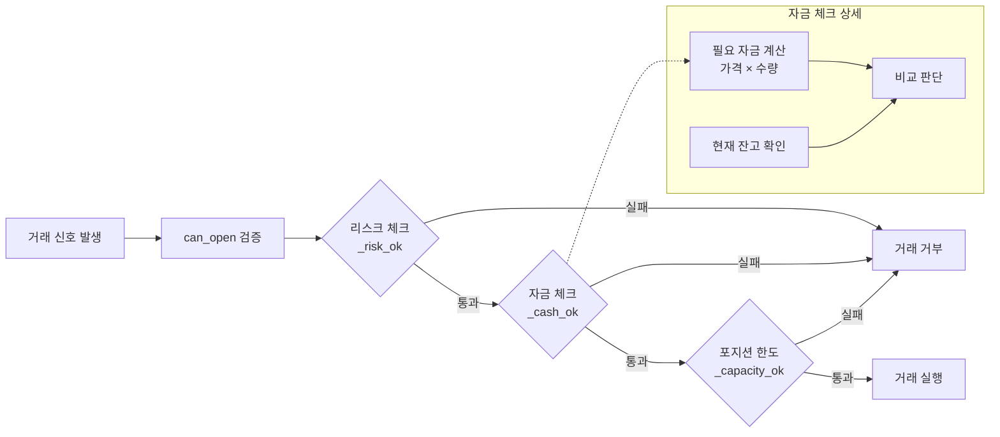
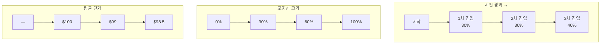
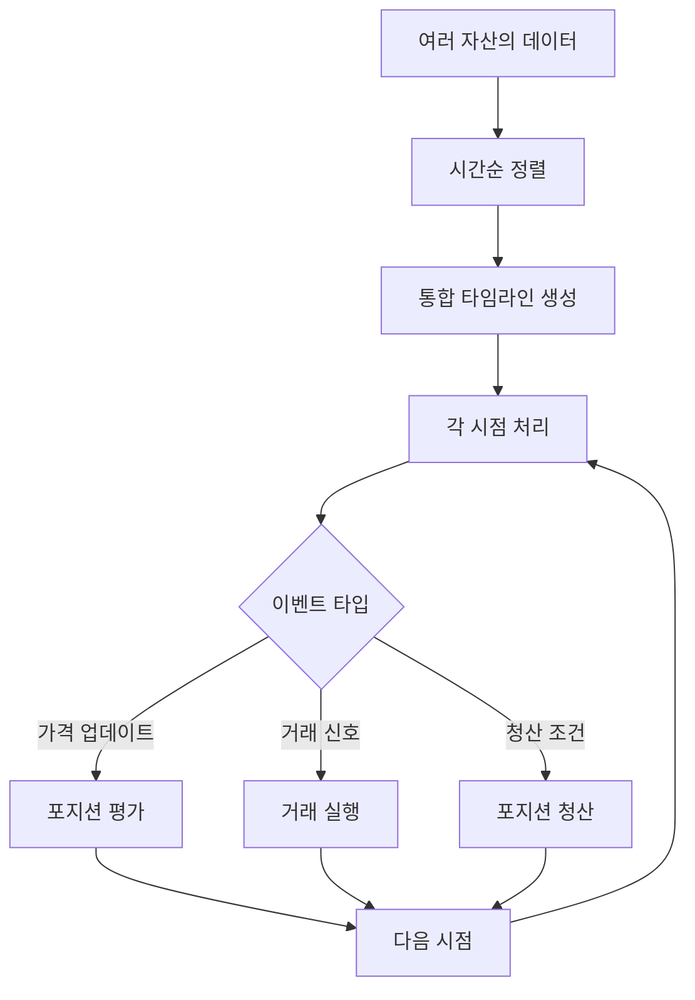
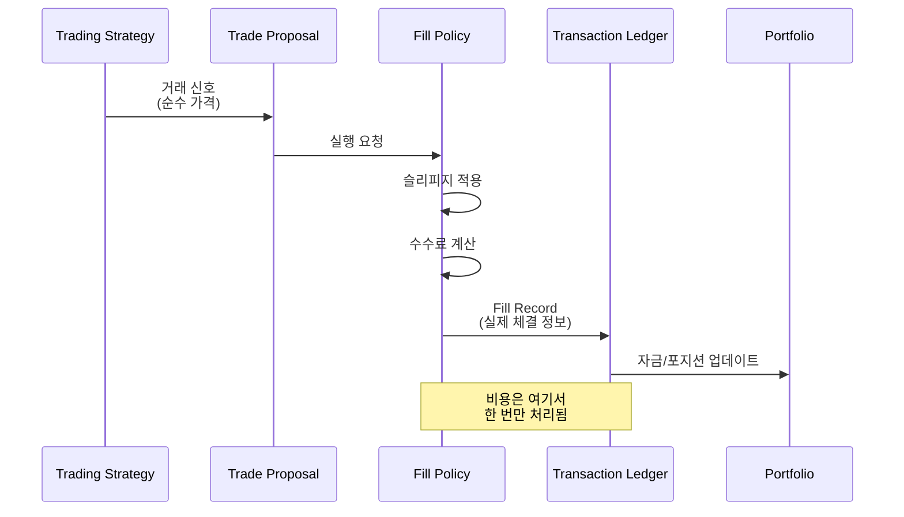
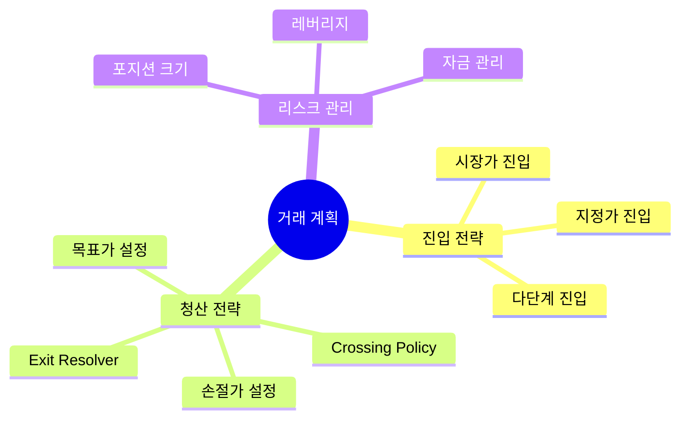
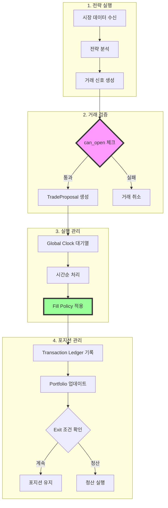

# 최근 업데이트 기능 설명서
## Recent Trading Bot Updates Explained

이 문서는 최근 트레이딩 봇에 추가된 주요 기능들을 비개발자도 이해할 수 있도록 설명합니다.

---

## 1. Exit Resolver Hook과 Crossing Policy (출구 전략 관리자)

### 개요
트레이딩에서 가장 중요한 것 중 하나는 "언제 포지션을 청산할 것인가"입니다. 이번 업데이트는 더 유연하고 지능적인 출구 전략을 가능하게 합니다.

### 작동 원리



### 상세 설명

#### Exit Resolver (출구 해결사)
- **목적**: 단순한 목표가/손절가 외에 복잡한 출구 조건을 설정
- **예시**: 
  - 특정 시간대에만 청산
  - 시장 변동성이 높을 때 조기 청산
  - 뉴스 이벤트 전 포지션 정리

#### Crossing Policy (교차 정책)
캔들 하나에서 목표가(TP)와 손절가(SL)가 동시에 도달했을 때의 처리 방법:
- **prefer_sl (기본값)**: 안전 우선 - 손실 제한
- **prefer_tp**: 수익 우선 - 이익 극대화
- **random**: 무작위 선택 - 백테스트 시 다양한 시나리오 테스트

---

## 2. Cash Checks 개선 (자금 검증 시스템)

### 개요
거래 전 충분한 자금이 있는지 확인하는 시스템이 더 명확하고 체계적으로 개선되었습니다.

### 자금 검증 프로세스



### 개선사항
1. **명시적 검증**: 모든 검증이 `can_open` 메서드에 통합
2. **단계별 확인**: 리스크 → 자금 → 포지션 한도 순서로 체크
3. **투명성**: 각 단계가 명확히 분리되어 디버깅 용이

---

## 3. Multi-Leg Entry/Exit (다단계 진입/청산)

### 개요
한 번에 전체 포지션을 진입하는 대신, 여러 단계로 나누어 진입하거나 청산할 수 있는 기능입니다.

### 다단계 진입 예시



### 장점
- **리스크 분산**: 한 번에 모든 자금을 투입하지 않음
- **평균 단가 개선**: 가격이 유리하게 움직일 때 추가 진입
- **유연성**: 시장 상황에 따라 진입 중단 가능

### 활용 예시
```
초기 신호: BTC $100,000에서 매수 신호
- 1차: $100,000에서 30% 진입
- 2차: $99,000 하락 시 30% 추가 (평균가 개선)
- 3차: $98,000 하락 시 40% 추가 (최종 진입)
최종 평균가: $98,500
```

---

## 4. Global Clock Driver (글로벌 시계 드라이버)

### 개요
여러 자산을 동시에 거래할 때, 모든 이벤트를 정확한 시간 순서대로 처리하는 시스템입니다.

### 시간 동기화 프로세스

```mermaid
gantt
    title 글로벌 클럭 타임라인
    dateFormat HH:mm
    axisFormat %H:%M
    
    section BTC/USDT
    1시간봉 데이터    :done, btc1, 09:00, 1h
    15분봉 데이터     :done, btc2, 09:15, 15m
    15분봉 데이터     :done, btc3, 09:30, 15m
    15분봉 데이터     :done, btc4, 09:45, 15m
    
    section ETH/USDT
    1시간봉 데이터    :done, eth1, 09:00, 1h
    거래 신호         :crit, ethsig, 09:20, 5m
    
    section 통합 타임라인
    통합 처리         :active, unified, 09:00, 1h
```



### 작동 방식



### 중요성
- **정확성**: 모든 거래가 올바른 순서로 실행
- **공정성**: 먼저 발생한 신호가 먼저 처리
- **현실성**: 실제 시장과 동일한 시간 흐름 재현

---

## 5. Single-Pass Cost Model (단일 비용 처리 모델)

### 개요
거래 비용(수수료, 슬리피지)을 한 번만 정확하게 계산하여 적용하는 시스템입니다.

### 비용 처리 흐름



### 개선사항

#### 이전 방식의 문제점


#### 새로운 방식


### 실제 예시
```
매수 신호: BTC $100,000
슬리피지: 0.1% = $100
수수료: 0.05% = $50

이전: 여러 단계에서 중복 계산 가능
현재: 한 번에 계산 → 실제 체결가 $100,150
```

---

## 6. TradeProposalBuilder 개선

### 개요
거래 계획을 쉽게 만들 수 있도록 도와주는 도구가 개선되었습니다.

### 거래 계획 구성 요소



### 사용 예시
```python
# 비개발자를 위한 설명:
# 1. BTC를 $100,000에서 매수
# 2. 3단계로 나누어 진입
# 3. 목표가: 5% 상승
# 4. 손절가: 2% 하락
# 5. 동시 도달 시: 손절 우선
```

---

## 종합 시스템 흐름도



---

## 요약

이번 업데이트들은 트레이딩 봇을 더욱 정교하고 현실적으로 만들었습니다:

1. **더 스마트한 출구 전략**: Exit Resolver와 Crossing Policy
2. **명확한 자금 관리**: 개선된 Cash Checks
3. **유연한 진입 방식**: Multi-Leg Entry/Exit
4. **정확한 시간 처리**: Global Clock Driver
5. **투명한 비용 계산**: Single-Pass Cost Model

이 모든 개선사항은 백테스트의 정확성을 높이고, 실제 거래 환경을 더 잘 반영하도록 설계되었습니다.