# Strategy Orchestrator Architecture Documentation / 전략 오케스트레이터 아키텍처 문서

## 개요 / Overview

### 한국어
Strategy Orchestrator는 바이낸스 트레이딩 봇의 핵심 구성 요소로, 트레이딩 전략을 안전하고 격리된 환경에서 실행하는 시스템입니다. 이 시스템은 Docker 컨테이너를 활용하여 각 백테스트를 샌드박스 환경에서 실행하며, 읽기 전용 MongoDB 접근을 통해 시스템 보안을 보장합니다.

주요 특징:
- 병렬 처리를 통한 고성능 백테스팅
- Docker 컨테이너 기반 격리 실행
- 읽기 전용 데이터베이스 접근으로 데이터 무결성 보장
- 유연한 전략 플러그인 시스템

### English
The Strategy Orchestrator is a core component of the Binance Trading Bot that executes trading strategies in a secure, isolated environment. The system leverages Docker containers to run each backtest in a sandboxed environment and ensures system security through read-only MongoDB access.

Key features:
- High-performance backtesting through parallel processing
- Docker container-based isolated execution
- Data integrity guaranteed through read-only database access
- Flexible strategy plugin system

## 시스템 아키텍처 / System Architecture

### 상위 수준 아키텍처 / High-Level Architecture

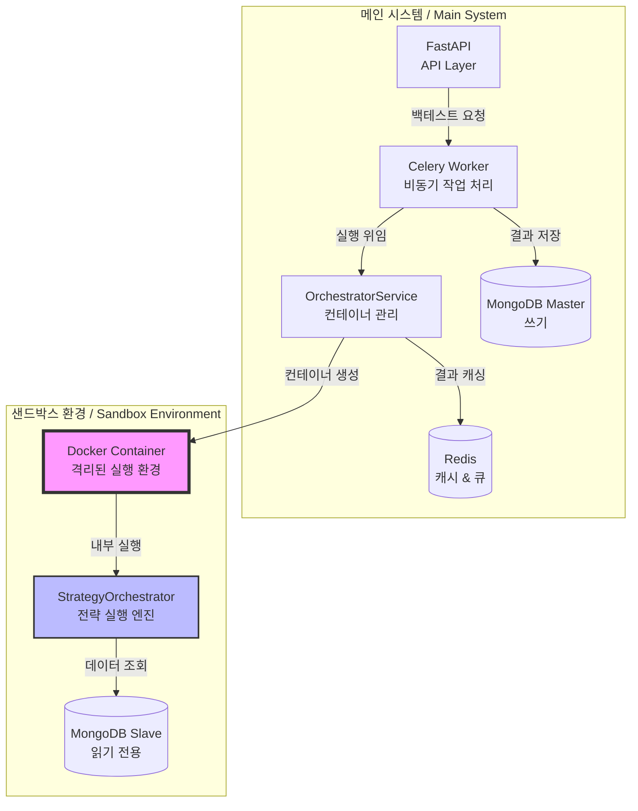

### 컴포넌트 관계도 / Component Relationships

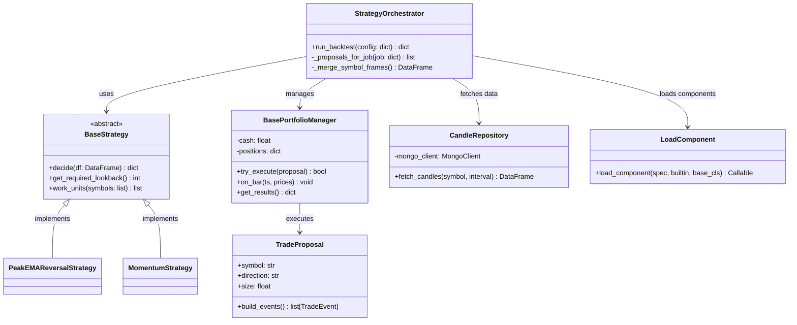

## 핵심 워크플로우 / Core Workflows

### 백테스트 실행 프로세스 / Backtest Execution Process

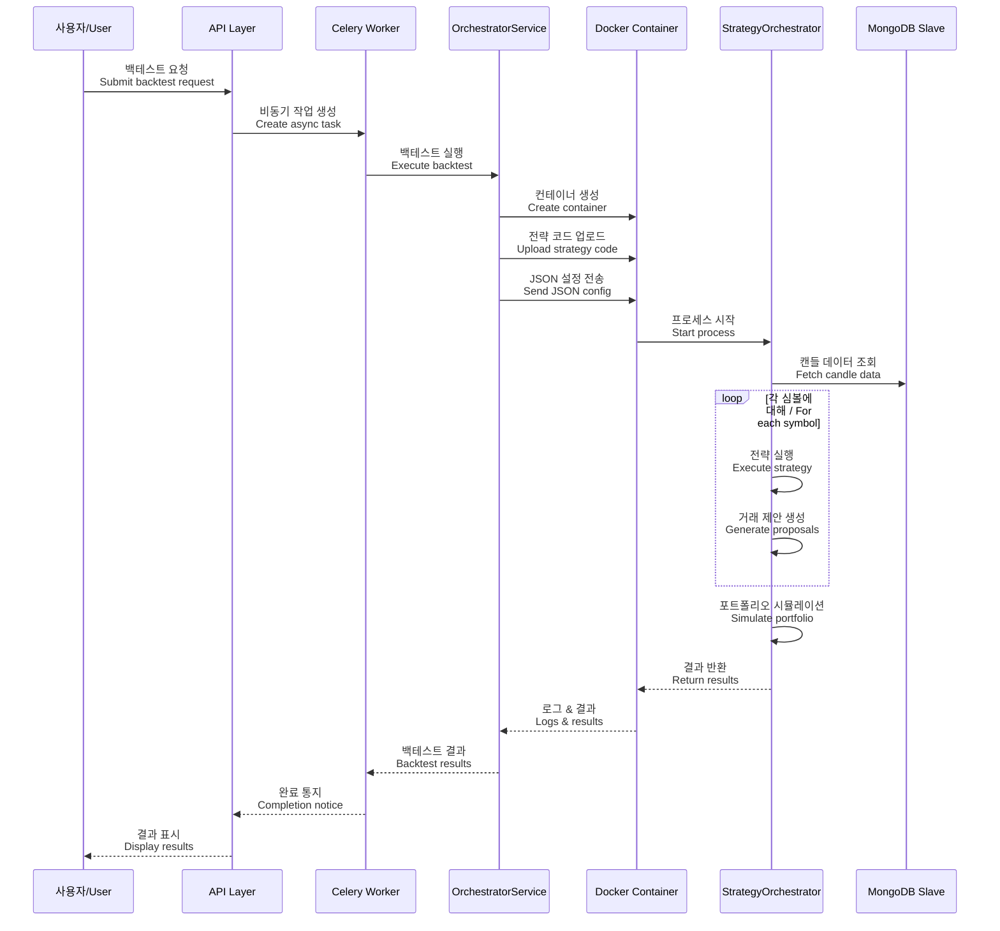

### 전략 실행 상세 플로우 / Strategy Execution Detail Flow

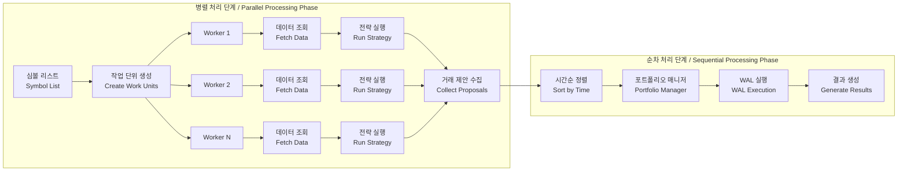

## 기술적 상세 구현 / Technical Implementation Details

### 컴포넌트 로딩 시스템 / Component Loading System

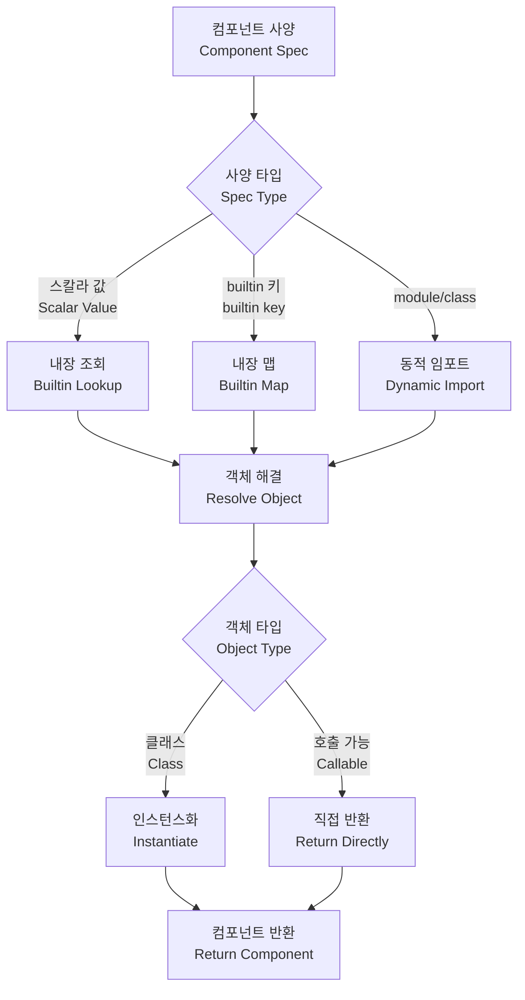

### 데이터 접근 패턴 / Data Access Pattern

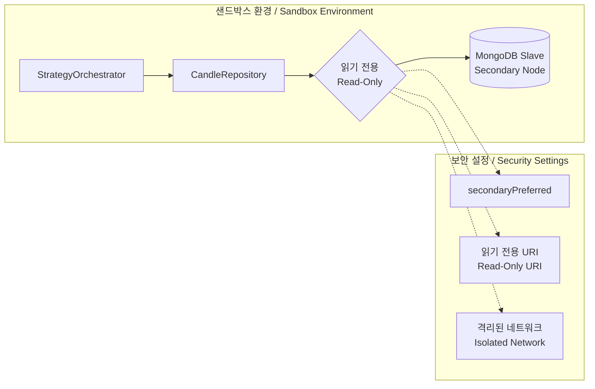

## 주요 디자인 결정 / Key Design Decisions

### 샌드박싱 전략 / Sandboxing Strategy

#### 한국어
1. **컨테이너 격리**: 각 백테스트는 독립적인 Docker 컨테이너에서 실행되어 호스트 시스템과 완전히 격리됩니다.
2. **읽기 전용 데이터 접근**: MongoDB slave 노드에만 접근하여 데이터 무결성을 보장합니다.
3. **리소스 제한**: 메모리(2GB)와 CPU 할당량을 제한하여 시스템 안정성을 유지합니다.
4. **자동 정리**: 컨테이너는 실행 후 자동으로 제거되어 리소스 누수를 방지합니다.

#### English
1. **Container Isolation**: Each backtest runs in an independent Docker container, completely isolated from the host system.
2. **Read-Only Data Access**: Access only to MongoDB slave nodes ensures data integrity.
3. **Resource Limits**: Memory (2GB) and CPU quotas maintain system stability.
4. **Automatic Cleanup**: Containers are automatically removed after execution to prevent resource leaks.

### 병렬 처리 아키텍처 / Parallel Processing Architecture

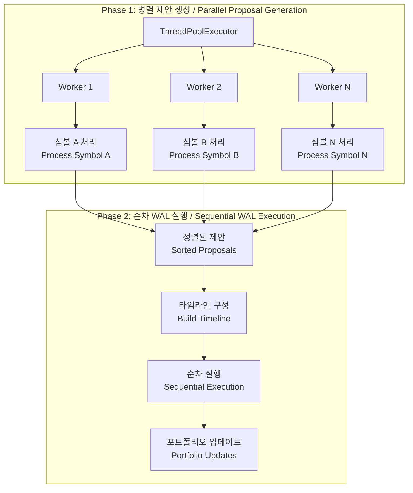

## 보안 고려사항 / Security Considerations

### 보안 계층 / Security Layers

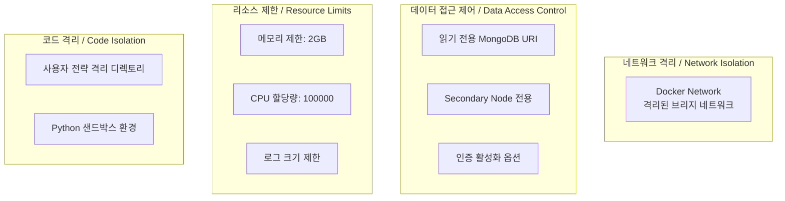

## 사용자를 위한 가이드 / User Guide

### 퀀트 투자자를 위한 설명 / For Quantitative Investors

#### 한국어
Strategy Orchestrator는 여러분의 트레이딩 전략을 안전하게 테스트할 수 있는 백테스팅 엔진입니다. 

**작동 방식:**
1. 전략 정의: 매수/매도 조건을 Python 코드로 작성
2. 데이터 준비: 시스템이 자동으로 과거 가격 데이터를 로드
3. 시뮬레이션: 실제 시장과 동일한 조건에서 전략 실행
4. 결과 분석: 수익률, 거래 횟수, 승률 등 상세 지표 제공

**주요 이점:**
- 실제 자금 위험 없이 전략 검증
- 다양한 시장 조건에서 전략 성능 평가
- 병렬 처리로 빠른 백테스트 실행
- 전략 코드가 시스템에 영향을 주지 않는 안전한 실행

#### English
The Strategy Orchestrator is a backtesting engine that allows you to safely test your trading strategies.

**How it works:**
1. Define Strategy: Write buy/sell conditions in Python code
2. Data Preparation: System automatically loads historical price data
3. Simulation: Execute strategy under real market conditions
4. Result Analysis: Provides detailed metrics like returns, trade count, win rate

**Key Benefits:**
- Validate strategies without real capital risk
- Evaluate strategy performance under various market conditions
- Fast backtesting through parallel processing
- Safe execution where strategy code cannot affect the system

### 프로그래머를 위한 구현 세부사항 / Implementation Details for Programmers

#### 전략 개발 가이드 / Strategy Development Guide

```python
# 커스텀 전략 예제 / Custom Strategy Example
from strategyOrchestrator.entities.strategies.BaseStrategy import BaseStrategy

class MyCustomStrategy(BaseStrategy):
    def decide(self, df: pd.DataFrame, interval: str, **kwargs) -> Dict[str, Any]:
        """
        전략 로직 구현 / Implement strategy logic
        
        Args:
            df: OHLCV 데이터프레임 / OHLCV dataframe
            interval: 시간 간격 (예: '1h', '1d') / Time interval
            
        Returns:
            거래 신호 딕셔너리 / Trade signal dictionary
        """
        # 전략 로직 구현
        signal = self._analyze_market(df)
        
        return {
            "signal": signal,  # "BUY", "SELL", or "NO"
            "entry_price": entry_price,
            "tp_price": take_profit_price,
            "sl_price": stop_loss_price,
            "confidence": confidence_score,
            "meta": {"custom_data": value}
        }
```

#### 플러그인 시스템 활용 / Using the Plugin System

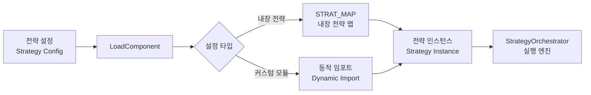

## 성능 최적화 / Performance Optimization

### 병렬 처리 최적화 / Parallel Processing Optimization

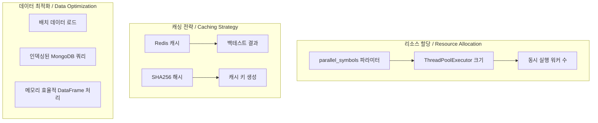

## 확장성 고려사항 / Scalability Considerations

### 미래 확장 가능성 / Future Extensibility

#### 한국어
1. **전략 마켓플레이스**: 사용자가 전략을 공유하고 거래할 수 있는 생태계
2. **실시간 거래 통합**: 백테스트에서 검증된 전략을 실거래로 연결
3. **ML 모델 지원**: 머신러닝 기반 전략 실행을 위한 프레임워크
4. **분산 백테스팅**: 여러 노드에서 대규모 백테스트 실행

#### English
1. **Strategy Marketplace**: Ecosystem for users to share and trade strategies
2. **Live Trading Integration**: Connect validated strategies from backtests to live trading
3. **ML Model Support**: Framework for executing machine learning-based strategies
4. **Distributed Backtesting**: Large-scale backtesting across multiple nodes

## 문제 해결 가이드 / Troubleshooting Guide

### 일반적인 문제와 해결책 / Common Issues and Solutions

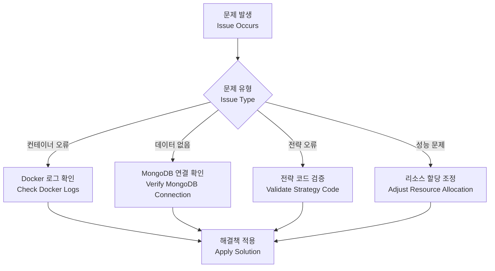

## 결론 / Conclusion

### 한국어
Strategy Orchestrator는 안전하고 효율적인 백테스팅을 위한 강력한 시스템입니다. Docker 기반 격리, 읽기 전용 데이터 접근, 병렬 처리를 통해 대규모 전략 테스트를 안정적으로 수행할 수 있습니다. 이 아키텍처는 확장성과 보안성을 모두 고려하여 설계되었으며, 향후 실시간 거래 시스템으로의 전환도 용이합니다.

### English
The Strategy Orchestrator is a powerful system for safe and efficient backtesting. Through Docker-based isolation, read-only data access, and parallel processing, it can reliably perform large-scale strategy testing. This architecture is designed with both scalability and security in mind, making it easy to transition to real-time trading systems in the future.
