# Strategy Orchestrator 상세 아키텍처 문서 / Strategy Orchestrator Detailed Architecture Documentation

## 목차 / Table of Contents

1. [개요 / Overview](#개요--overview)
2. [전체 아키텍처 / Overall Architecture](#전체-아키텍처--overall-architecture)
3. [핵심 컴포넌트 상세 분석 / Core Component Detailed Analysis](#핵심-컴포넌트-상세-분석--core-component-detailed-analysis)
4. [데이터 흐름 및 처리 과정 / Data Flow and Processing](#데이터-흐름-및-처리-과정--data-flow-and-processing)
5. [클래스 다이어그램 및 관계 / Class Diagrams and Relationships](#클래스-다이어그램-및-관계--class-diagrams-and-relationships)
6. [보안 및 격리 메커니즘 / Security and Isolation Mechanisms](#보안-및-격리-메커니즘--security-and-isolation-mechanisms)
7. [성능 최적화 전략 / Performance Optimization Strategies](#성능-최적화-전략--performance-optimization-strategies)
8. [확장 포인트 및 플러그인 시스템 / Extension Points and Plugin System](#확장-포인트-및-플러그인-시스템--extension-points-and-plugin-system)

## 개요 / Overview

### 한국어
Strategy Orchestrator는 바이낸스 트레이딩 봇의 핵심 백테스팅 엔진으로, 트레이딩 전략을 안전하고 격리된 Docker 컨테이너 환경에서 실행합니다. 이 시스템은 다음과 같은 핵심 기능을 제공합니다:

- **병렬 처리 아키텍처**: ThreadPoolExecutor를 통한 멀티스레드 병렬 처리로 여러 심볼의 전략을 동시에 평가
- **2단계 실행 모델**: 병렬 제안 생성 후 순차적 WAL(Write-Ahead Log) 실행
- **플러그인 기반 확장성**: 전략, 수수료 모델, 사이징 모델 등을 동적으로 로드
- **읽기 전용 데이터 접근**: MongoDB 슬레이브 노드를 통한 안전한 데이터 접근
- **상세한 거래 추적**: 모든 거래 이벤트와 포트폴리오 변화를 정밀하게 기록

### English
The Strategy Orchestrator is the core backtesting engine of the Binance Trading Bot, executing trading strategies in secure, isolated Docker container environments. The system provides the following core features:

- **Parallel Processing Architecture**: Multi-threaded parallel processing through ThreadPoolExecutor to evaluate strategies for multiple symbols simultaneously
- **Two-Phase Execution Model**: Parallel proposal generation followed by sequential WAL (Write-Ahead Log) execution
- **Plugin-Based Extensibility**: Dynamically load strategies, fee models, sizing models, etc.
- **Read-Only Data Access**: Secure data access through MongoDB slave nodes
- **Detailed Trade Tracking**: Precisely record all trade events and portfolio changes

## 전체 아키텍처 / Overall Architecture

### 시스템 구성도 / System Architecture Diagram

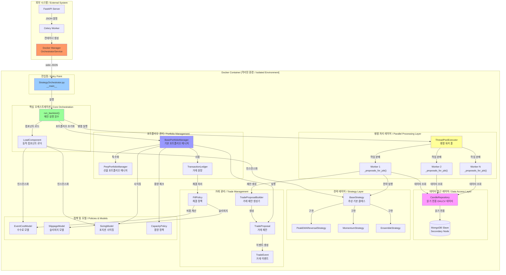

## 핵심 컴포넌트 상세 분석 / Core Component Detailed Analysis

### 1. StrategyOrchestrator.py - 메인 오케스트레이터 / Main Orchestrator

#### 한국어 설명
이 파일은 전체 백테스팅 프로세스의 진입점이자 조정자 역할을 합니다. 주요 책임:

1. **설정 파싱**: stdin으로 JSON 설정을 받아 파싱
2. **컴포넌트 초기화**: LoadComponent를 통해 필요한 모든 컴포넌트 동적 로드
3. **병렬 처리 관리**: ThreadPoolExecutor로 멀티스레드 작업 분배
4. **타임라인 구성**: 모든 거래 이벤트를 시간순으로 정렬하여 실행
5. **결과 집계**: 최종 백테스트 결과 생성 및 반환

#### English Description
This file serves as the entry point and coordinator for the entire backtesting process. Key responsibilities:

1. **Configuration Parsing**: Receive and parse JSON configuration from stdin
2. **Component Initialization**: Dynamically load all necessary components through LoadComponent
3. **Parallel Processing Management**: Distribute multi-threaded tasks via ThreadPoolExecutor
4. **Timeline Construction**: Sort and execute all trade events chronologically
5. **Result Aggregation**: Generate and return final backtest results

#### 핵심 함수 분석 / Core Function Analysis

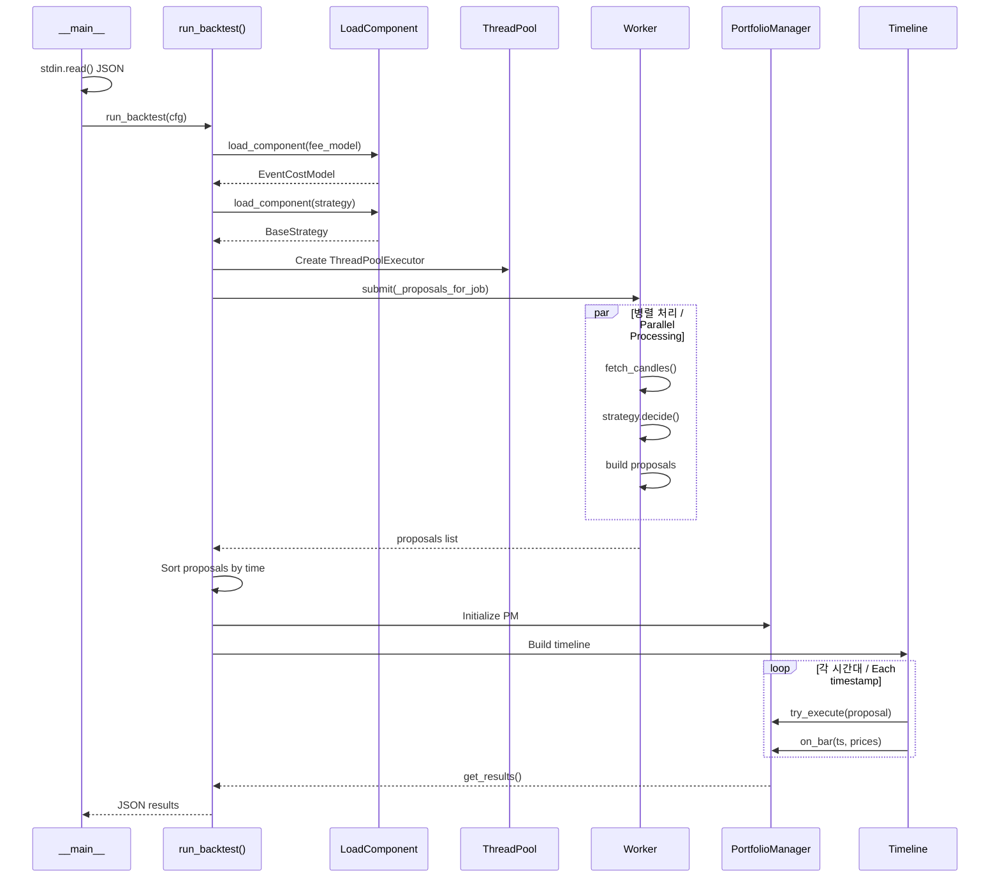

### 2. LoadComponent.py - 동적 컴포넌트 로더 / Dynamic Component Loader

#### 한국어 설명
LoadComponent는 플러그인 시스템의 핵심으로, 다양한 형태의 컴포넌트 사양을 받아 실제 실행 가능한 객체로 변환합니다.

**지원하는 사양 형태:**
1. **스칼라 값**: 숫자나 문자열 → 내장 맵에서 조회
2. **내장 참조**: `{"builtin": "token"}` → 내장 컴포넌트 사용
3. **동적 임포트**: `{"module": "x.y", "class": "Cls"}` → 런타임 모듈 로드

#### English Description
LoadComponent is the core of the plugin system, converting various component specifications into actual executable objects.

**Supported specification formats:**
1. **Scalar values**: Numbers or strings → lookup in built-in maps
2. **Built-in references**: `{"builtin": "token"}` → use built-in components
3. **Dynamic imports**: `{"module": "x.y", "class": "Cls"}` → runtime module loading

#### 로드 프로세스 다이어그램 / Load Process Diagram

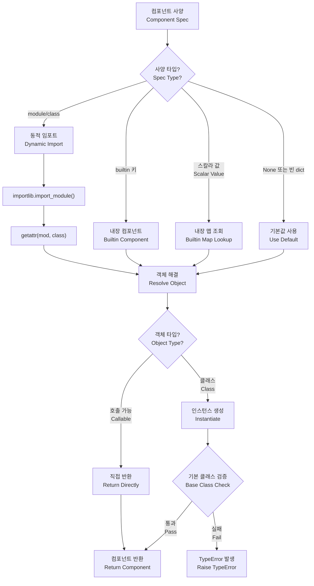

### 3. BaseStrategy.py - 전략 기본 클래스 / Strategy Base Class

#### 한국어 설명
모든 트레이딩 전략의 추상 기본 클래스로, 전략 개발을 위한 표준 인터페이스를 정의합니다.

**핵심 메서드:**
- `decide()`: 주어진 OHLCV 데이터로 매매 결정
- `work_units()`: 병렬 처리를 위한 작업 단위 생성
- `get_required_lookback()`: 필요한 과거 데이터 기간
- `filter_symbols()`: 전략에 맞는 심볼 필터링

#### English Description
Abstract base class for all trading strategies, defining the standard interface for strategy development.

**Core methods:**
- `decide()`: Make trading decisions based on OHLCV data
- `work_units()`: Create work units for parallel processing
- `get_required_lookback()`: Required historical data period
- `filter_symbols()`: Filter symbols suitable for the strategy

#### 전략 실행 흐름 / Strategy Execution Flow

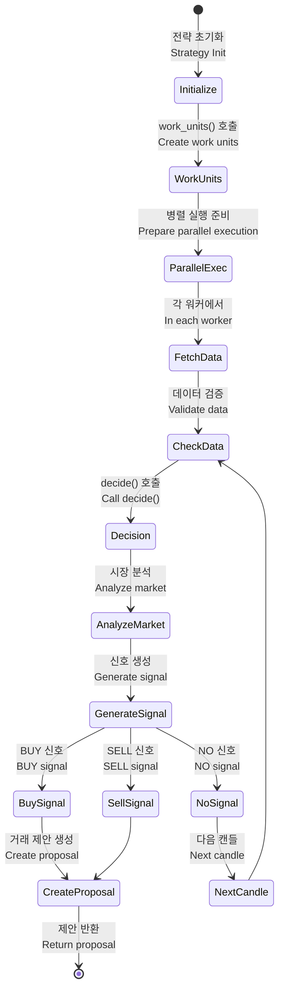

### 4. BasePortfolioManager.py - 포트폴리오 관리자 / Portfolio Manager

#### 한국어 설명
이벤트 기반 포트폴리오 관리자로, 거래 이벤트를 처리하고 포지션과 현금을 추적합니다.

**주요 기능:**
1. **거래 이벤트 큐 관리**: 힙 기반 우선순위 큐로 시간순 처리
2. **포지션 추적**: 각 심볼별 포지션 상태 관리
3. **현금 흐름 관리**: 거래에 따른 현금 변동 추적
4. **리스크 관리**: 용량 정책, 현금 확인 등
5. **성과 측정**: 주식 곡선, 거래 로그 생성

#### English Description
Event-driven portfolio manager that processes trade events and tracks positions and cash.

**Key features:**
1. **Trade Event Queue Management**: Time-ordered processing with heap-based priority queue
2. **Position Tracking**: Manage position state for each symbol
3. **Cash Flow Management**: Track cash changes from trades
4. **Risk Management**: Capacity policies, cash checks, etc.
5. **Performance Measurement**: Generate equity curves, trade logs

#### 포트폴리오 관리 상태 머신 / Portfolio Management State Machine

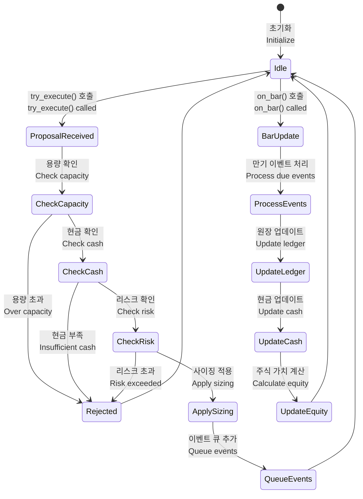

### 5. CandleRepository.py - 캔들 데이터 저장소 / Candle Data Repository

#### 한국어 설명
읽기 전용 OHLCV 데이터 접근을 위한 저장소 패턴 구현입니다. MongoDB 슬레이브 노드에만 연결하여 데이터 무결성을 보장합니다.

**보안 특징:**
- `secondaryPreferred` 읽기 설정 강제
- 연결 타임아웃 설정
- 커넥션 풀 관리

#### English Description
Repository pattern implementation for read-only OHLCV data access. Connects only to MongoDB slave nodes to ensure data integrity.

**Security features:**
- Force `secondaryPreferred` read preference
- Connection timeout settings
- Connection pool management

### 6. TradeProposal 및 TradeProposalBuilder - 거래 제안 시스템 / Trade Proposal System

#### 한국어 설명
거래 제안은 실행할 거래 계획을 선언적으로 표현합니다. Builder 패턴을 사용하여 복잡한 거래 전략을 구성할 수 있습니다.

**특징:**
- 다중 레그 지원 (scale-in/scale-out)
- 브래킷 주문 (TP/SL)
- 유연한 가격 참조
- 이벤트 기반 실행

#### English Description
Trade proposals declaratively express trading plans to execute. Using the Builder pattern, complex trading strategies can be composed.

**Features:**
- Multi-leg support (scale-in/scale-out)
- Bracket orders (TP/SL)
- Flexible price references
- Event-based execution

#### 거래 제안 생성 프로세스 / Trade Proposal Creation Process

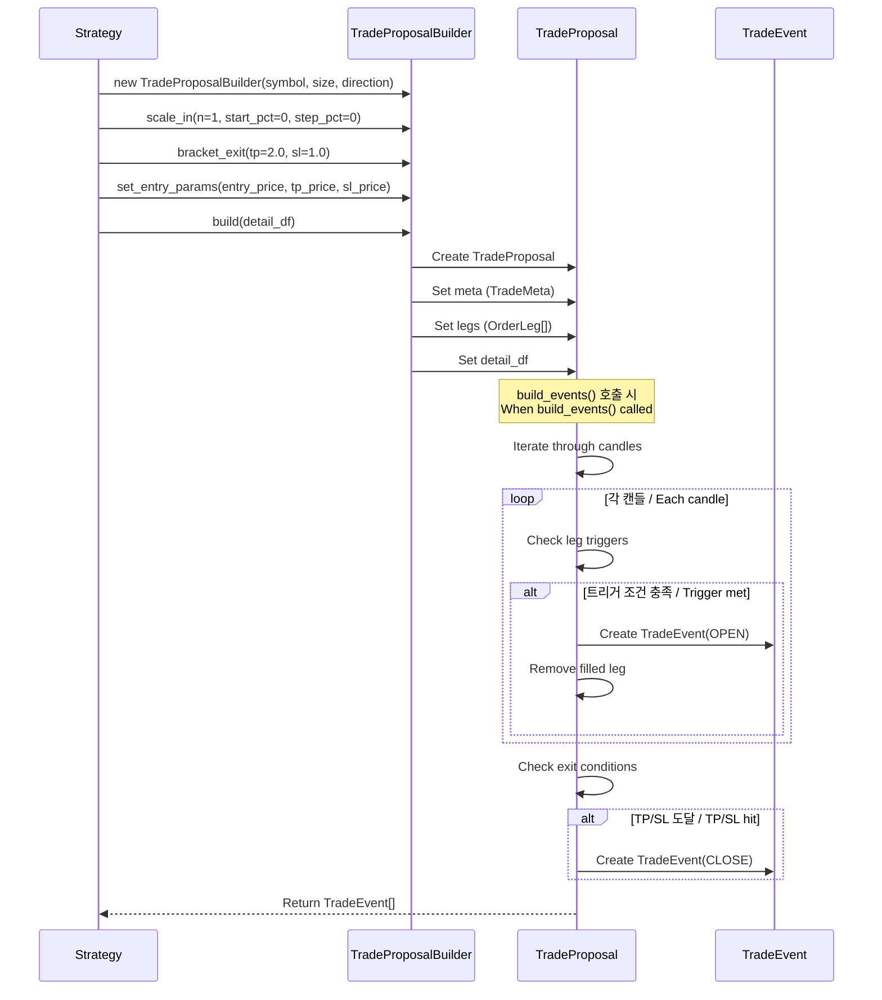

### 7. TransactionLedger - 거래 원장 / Transaction Ledger

#### 한국어 설명
모든 거래의 확정적 기록을 관리하는 원장 시스템입니다. 체결 정책을 통해 거래 이벤트를 실제 체결로 변환합니다.

**핵심 기능:**
- 포지션 추적
- 현금 델타 관리
- 체결 기록 저장
- 미실현 손익 계산

#### English Description
Ledger system that manages deterministic records of all trades. Converts trade events to actual fills through fill policies.

**Core features:**
- Position tracking
- Cash delta management
- Fill record storage
- Unrealized P&L calculation

## 데이터 흐름 및 처리 과정 / Data Flow and Processing

### 전체 데이터 흐름도 / Complete Data Flow Diagram

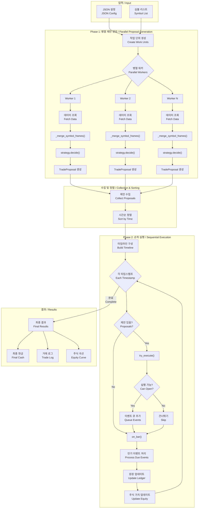

### 병렬 처리 상세 / Parallel Processing Details

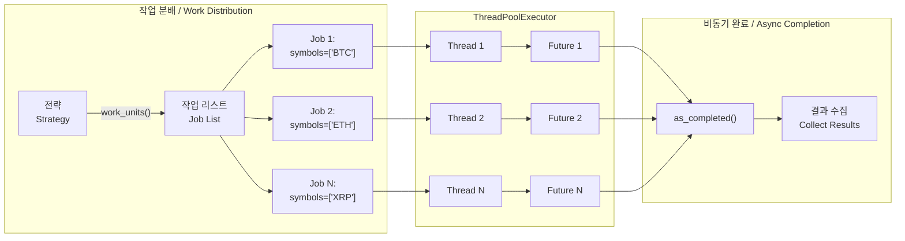

## 클래스 다이어그램 및 관계 / Class Diagrams and Relationships

### 전체 클래스 관계도 / Complete Class Relationship Diagram

```mermaid
classDiagram
    %% 핵심 클래스들 / Core Classes
    class StrategyOrchestrator {
        +run_backtest(cfg: dict) dict
        -_new_logger() Logger
        -_merge_symbol_frames() DataFrame
        -_proposals_for_job() list
    }
    
    class LoadComponent {
        +load_component(spec, builtin, base_cls, label) Callable
    }
    
    %% 전략 계층 / Strategy Layer
    class BaseStrategy {
        <<abstract>>
        +decide(df, interval, **kwargs) dict
        +work_units(symbols) list
        +get_required_lookback() int
        +filter_symbols(symbols_df) list
        +aggregate_signals(trades) Any
        +required_indicators() list
        +fit(data) void
        +reset() void
        +set_params(**params) void
        +get_params() dict
        +get_indicator_periods() list
    }
    
    class PeakEMAReversalStrategy {
        +decide(df, interval, **kwargs) dict
        -_calculate_emas(df) tuple
        -_check_peak_reversal(emas) bool
    }
    
    class MomentumStrategy {
        +decide(df, interval, **kwargs) dict
        -_calculate_momentum(df) float
    }
    
    class EnsembleStrategy {
        -strategies: list[BaseStrategy]
        +decide(df, interval, **kwargs) dict
        +add_strategy(strategy) void
    }
    
    %% 포트폴리오 관리 / Portfolio Management
    class BasePortfolioManager {
        -cash: float
        -capacity: CapacityPolicy
        -sizer: SizingModel
        -tm: TransactionLedger
        -_event_q: list[TradeEvent]
        -_trade_log: list[dict]
        -equity_curve: list[dict]
        +try_execute(proposal, now_ts) bool
        +on_bar(ts, mark_prices) void
        +can_open(proposal, now_ts, first_entry) bool
        +get_results() dict
        #_open_symbols() set
        #_open_legs() int
        #_risk_ok(meta) bool
        #_cash_ok(entry_px, size) bool
        #_log_exit(ev, exec_px) void
    }
    
    class PerpPortfolioManager {
        -funding_rates: dict
        +apply_funding(ts) void
        +calculate_margin() float
    }
    
    %% 거래 관리 / Trade Management
    class TradeProposal {
        +meta: TradeMeta
        +legs: list[OrderLeg]
        +detail_df: DataFrame
        +build_events() list[TradeEvent]
        +realize() list[TradeEvent]
        -_triggered(idx, ts, candle, cond) bool
        -_resolve_price(candle, px) float
        -_check_exit(candle, tp_px, sl_px) dict
    }
    
    class TradeProposalBuilder {
        -symbol: str
        -size: float
        -direction: str
        -_legs: list[OrderLeg]
        +scale_in(n, start_pct, step_pct, reference) self
        +bracket_exit(tp, sl, crossing_policy, exit_resolver) self
        +set_entry_params(entry_price, tp_price, sl_price, entry_ts) self
        +build(detail_df) TradeProposal
    }
    
    class TradeMeta {
        +symbol: str
        +entry_time: int
        +entry_price: float
        +tp_price: float
        +sl_price: float
        +size: float
        +direction: str
    }
    
    class TradeEvent {
        +ts: int
        +price: float
        +qty: float
        +event: TradeEventType
        +meta: dict
        +is_entry: bool
        +is_exit: bool
    }
    
    class OrderLeg {
        +qty: float
        +side: str
        +px: float|Callable
        +when: int|float|Callable
        +tif: str
        +comment: str
    }
    
    %% 원장 시스템 / Ledger System
    class TransactionLedger {
        +positions: dict[str, Position]
        -_cash_log: list[tuple]
        -_fills: list[FillRecord]
        -_fill_policy: FillPolicy
        +ingest(events) void
        +current_cash_delta() float
        +pop_cash_delta() float
        +unrealised_pnl(mark_prices) float
        +get_fills() list[FillRecord]
        -_apply_fill(fill) void
    }
    
    class Position {
        +symbol: str
        +qty: float
        +avg_px: float
        +total_cost: float
        +apply(event) void
        +mark_to_market(price) float
    }
    
    class FillRecord {
        +ts: int
        +symbol: str
        +qty: float
        +exec_price: float
        +fee_cash: float
        +event: TradeEventType
        +meta: dict
    }
    
    %% 정책 인터페이스 / Policy Interfaces
    class CapacityPolicy {
        <<interface>>
        +admit(proposal, now_ts, event_q, open_symbols) bool
    }
    
    class EventCostModel {
        <<interface>>
        +__call__(event) float
    }
    
    class SizingModel {
        <<interface>>
        +__call__(meta, action) float
    }
    
    class FillPolicy {
        <<interface>>
        +fill(event, book) list[FillRecord]
    }
    
    %% 데이터 접근 / Data Access
    class CandleRepository {
        -_client: MongoClient
        -_col: Collection
        +fetch_candles(symbol, interval, limit, start_time, newest_first) DataFrame
    }
    
    %% 관계 정의 / Relationships
    StrategyOrchestrator ..> LoadComponent : uses
    StrategyOrchestrator ..> BaseStrategy : loads
    StrategyOrchestrator ..> BasePortfolioManager : creates
    StrategyOrchestrator ..> CandleRepository : uses
    StrategyOrchestrator ..> TradeProposalBuilder : uses
    
    LoadComponent ..> BaseStrategy : instantiates
    LoadComponent ..> CapacityPolicy : instantiates
    LoadComponent ..> EventCostModel : instantiates
    LoadComponent ..> SizingModel : instantiates
    LoadComponent ..> FillPolicy : instantiates
    
    BaseStrategy <|-- PeakEMAReversalStrategy : extends
    BaseStrategy <|-- MomentumStrategy : extends
    BaseStrategy <|-- EnsembleStrategy : extends
    
    BasePortfolioManager <|-- PerpPortfolioManager : extends
    BasePortfolioManager *-- TransactionLedger : contains
    BasePortfolioManager ..> TradeProposal : executes
    BasePortfolioManager ..> CapacityPolicy : uses
    BasePortfolioManager ..> SizingModel : uses
    
    TradeProposalBuilder ..> TradeProposal : builds
    TradeProposal *-- TradeMeta : contains
    TradeProposal *-- OrderLeg : contains
    TradeProposal ..> TradeEvent : generates
    
    TransactionLedger *-- Position : manages
    TransactionLedger *-- FillRecord : stores
    TransactionLedger ..> FillPolicy : uses
    TransactionLedger ..> EventCostModel : uses
```

### 이벤트 처리 시퀀스 / Event Processing Sequence

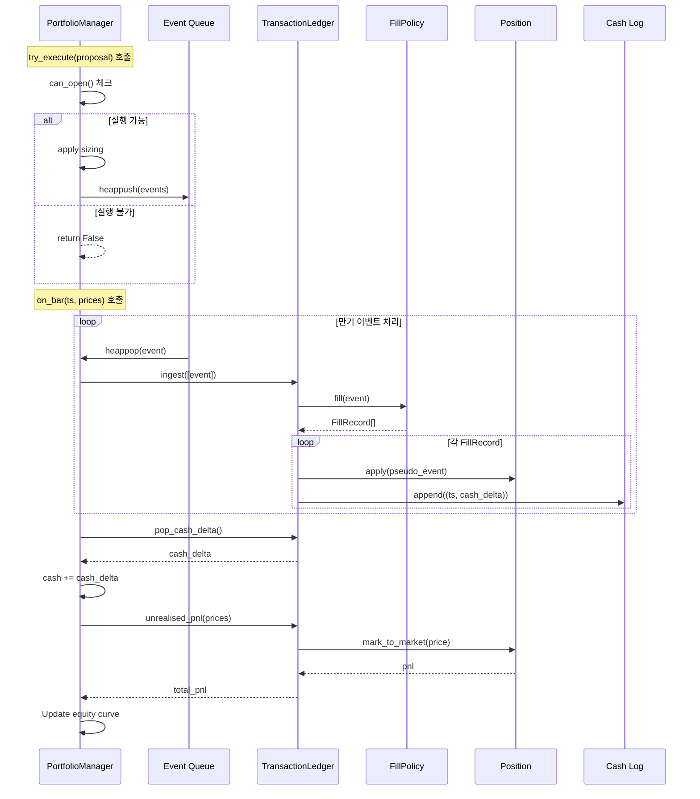

## 보안 및 격리 메커니즘 / Security and Isolation Mechanisms

### 보안 아키텍처 / Security Architecture

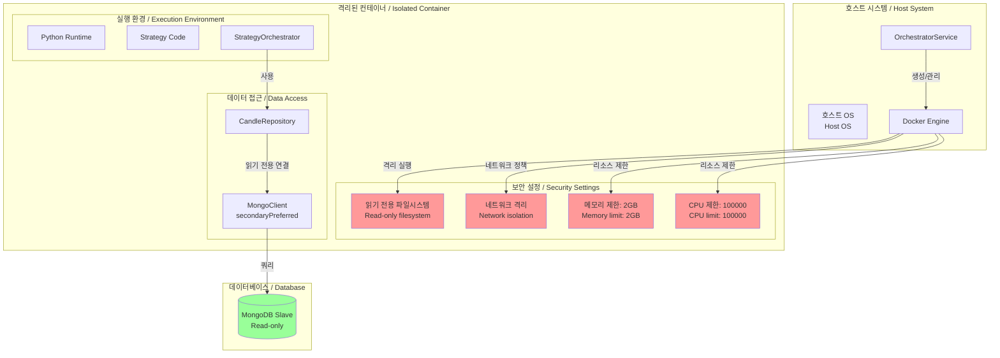

### 격리 레벨 / Isolation Levels

#### 한국어
1. **프로세스 격리**: Docker 컨테이너로 완전한 프로세스 격리
2. **파일시스템 격리**: 읽기 전용 마운트, 임시 파일 시스템
3. **네트워크 격리**: 별도의 브리지 네트워크, 외부 접근 차단
4. **리소스 격리**: cgroups를 통한 CPU/메모리 제한
5. **데이터 격리**: 읽기 전용 데이터베이스 접근

#### English
1. **Process Isolation**: Complete process isolation with Docker containers
2. **Filesystem Isolation**: Read-only mounts, temporary filesystems
3. **Network Isolation**: Separate bridge network, external access blocked
4. **Resource Isolation**: CPU/memory limits through cgroups
5. **Data Isolation**: Read-only database access

## 성능 최적화 전략 / Performance Optimization Strategies

### 최적화 기법 / Optimization Techniques

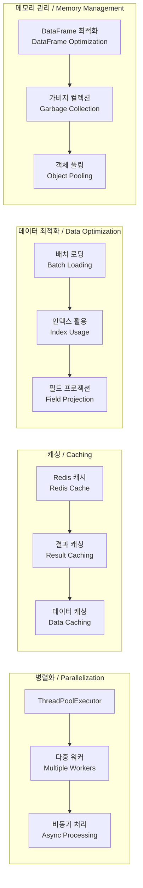

### 병렬 처리 최적화 상세 / Parallel Processing Optimization Details

#### 한국어
1. **작업 분배 전략**:
   - 심볼별 균등 분배
   - 데이터 크기 기반 동적 분배
   - CPU 코어 수 고려한 워커 수 설정

2. **메모리 효율성**:
   - DataFrame 청크 처리
   - 불필요한 컬럼 제거
   - 데이터 타입 최적화

3. **I/O 최적화**:
   - 배치 데이터베이스 쿼리
   - 연결 풀링
   - 비동기 I/O

#### English
1. **Work Distribution Strategy**:
   - Equal distribution by symbol
   - Dynamic distribution based on data size
   - Worker count based on CPU cores

2. **Memory Efficiency**:
   - DataFrame chunk processing
   - Remove unnecessary columns
   - Data type optimization

3. **I/O Optimization**:
   - Batch database queries
   - Connection pooling
   - Asynchronous I/O

## 확장 포인트 및 플러그인 시스템 / Extension Points and Plugin System

### 플러그인 아키텍처 / Plugin Architecture

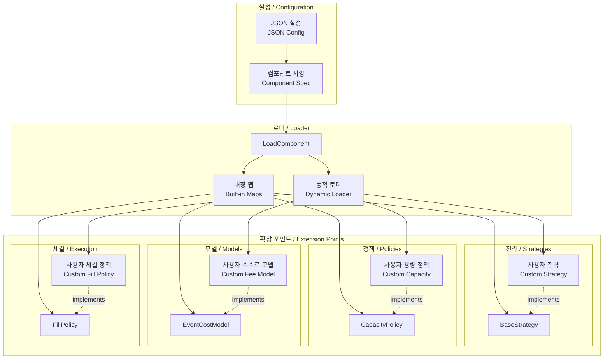

### 커스텀 컴포넌트 개발 가이드 / Custom Component Development Guide

#### 커스텀 전략 예제 / Custom Strategy Example

```python
# 커스텀 전략 구현 예제
from strategyOrchestrator.entities.strategies.BaseStrategy import BaseStrategy
import pandas as pd
from typing import Dict, Any, List

class MyCustomStrategy(BaseStrategy):
    """
    사용자 정의 트레이딩 전략
    Custom trading strategy
    """
    
    def __init__(self, **params):
        self.rsi_period = params.get('rsi_period', 14)
        self.rsi_oversold = params.get('rsi_oversold', 30)
        self.rsi_overbought = params.get('rsi_overbought', 70)
        
    def decide(self, df: pd.DataFrame, interval: str, **kwargs) -> Dict[str, Any]:
        """
        RSI 기반 매매 결정
        RSI-based trading decision
        """
        # RSI 계산
        rsi = self._calculate_rsi(df, self.rsi_period)
        
        # 매매 신호 생성
        if rsi.iloc[-1] < self.rsi_oversold:
            signal = "BUY"
            confidence = (self.rsi_oversold - rsi.iloc[-1]) / self.rsi_oversold
        elif rsi.iloc[-1] > self.rsi_overbought:
            signal = "SELL"
            confidence = (rsi.iloc[-1] - self.rsi_overbought) / (100 - self.rsi_overbought)
        else:
            signal = "NO"
            confidence = 0.0
            
        # 가격 계산
        current_price = float(df.iloc[-1]['close'])
        tp_price = current_price * (1 + kwargs.get('tp_ratio', 0.02))
        sl_price = current_price * (1 - kwargs.get('sl_ratio', 0.01))
        
        return {
            "signal": signal,
            "entry_price": current_price,
            "tp_price": tp_price,
            "sl_price": sl_price,
            "confidence": confidence,
            "meta": {
                "rsi": float(rsi.iloc[-1]),
                "strategy": "MyCustomStrategy"
            },
            "strategy_name": "MyCustomStrategy"
        }
    
    def get_required_lookback(self) -> int:
        """필요한 과거 데이터 기간"""
        return self.rsi_period + 10
    
    def _calculate_rsi(self, df: pd.DataFrame, period: int) -> pd.Series:
        """RSI 지표 계산"""
        # RSI 계산 로직
        pass
```

#### 설정 파일에서 사용 / Usage in Configuration

```json
{
    "strategy": {
        "module": "my_strategies.custom",
        "class": "MyCustomStrategy",
        "params": {
            "rsi_period": 14,
            "rsi_oversold": 25,
            "rsi_overbought": 75
        }
    }
}
```

## 디버깅 및 모니터링 / Debugging and Monitoring

### 로깅 아키텍처 / Logging Architecture

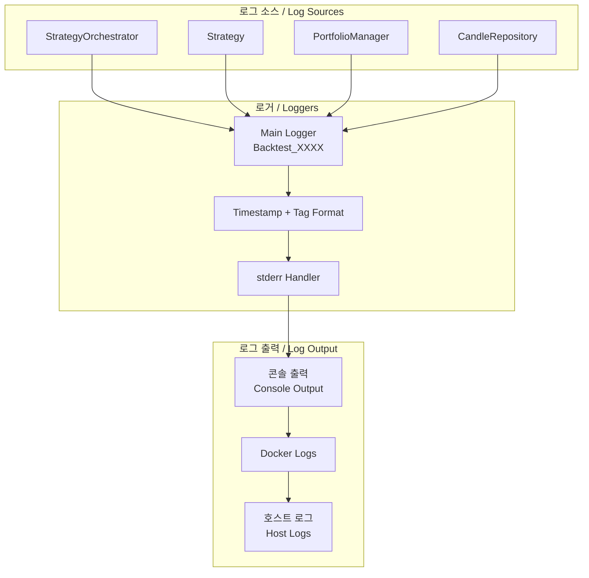

### 성능 모니터링 포인트 / Performance Monitoring Points

#### 한국어
1. **병렬 처리 성능**:
   - 워커별 처리 시간
   - 작업 큐 크기
   - 스레드 풀 활용률

2. **메모리 사용량**:
   - DataFrame 메모리 사용
   - 이벤트 큐 크기
   - 포지션 맵 크기

3. **데이터베이스 성능**:
   - 쿼리 실행 시간
   - 연결 풀 상태
   - 데이터 전송량

#### English
1. **Parallel Processing Performance**:
   - Processing time per worker
   - Work queue size
   - Thread pool utilization

2. **Memory Usage**:
   - DataFrame memory usage
   - Event queue size
   - Position map size

3. **Database Performance**:
   - Query execution time
   - Connection pool status
   - Data transfer volume

## 결론 / Conclusion

### 한국어
Strategy Orchestrator는 안전성, 확장성, 성능을 모두 고려한 정교한 백테스팅 시스템입니다. Docker 기반 격리, 병렬 처리, 플러그인 아키텍처를 통해 다양한 트레이딩 전략을 효율적으로 테스트할 수 있습니다. 이 문서에서 다룬 상세한 아키텍처와 구현 세부사항은 시스템의 유지보수와 확장에 필요한 모든 정보를 제공합니다.

### English
The Strategy Orchestrator is a sophisticated backtesting system that considers safety, scalability, and performance. Through Docker-based isolation, parallel processing, and plugin architecture, various trading strategies can be efficiently tested. The detailed architecture and implementation details covered in this document provide all the information necessary for system maintenance and extension.
