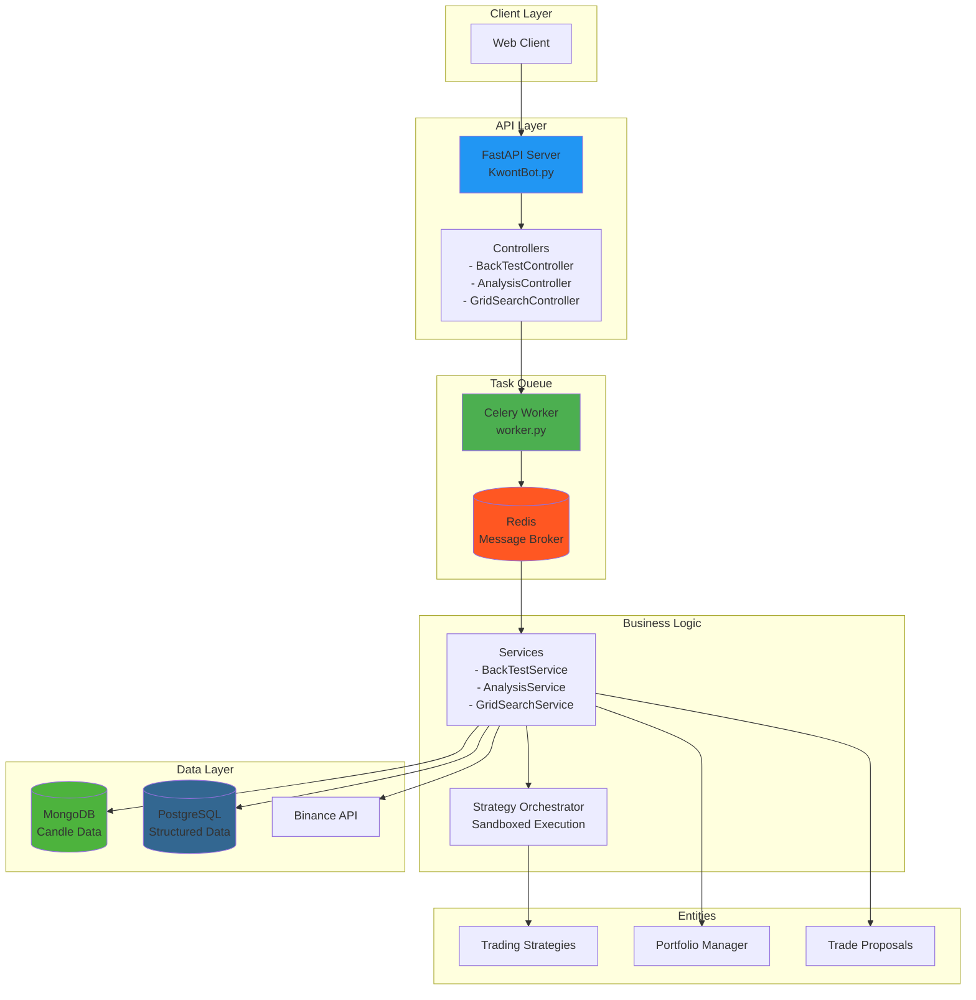
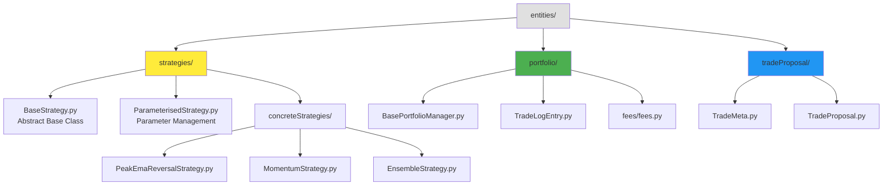
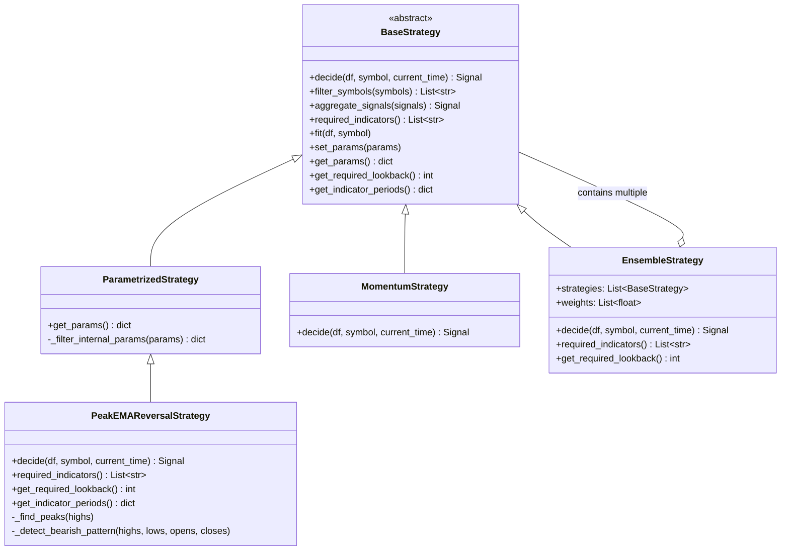
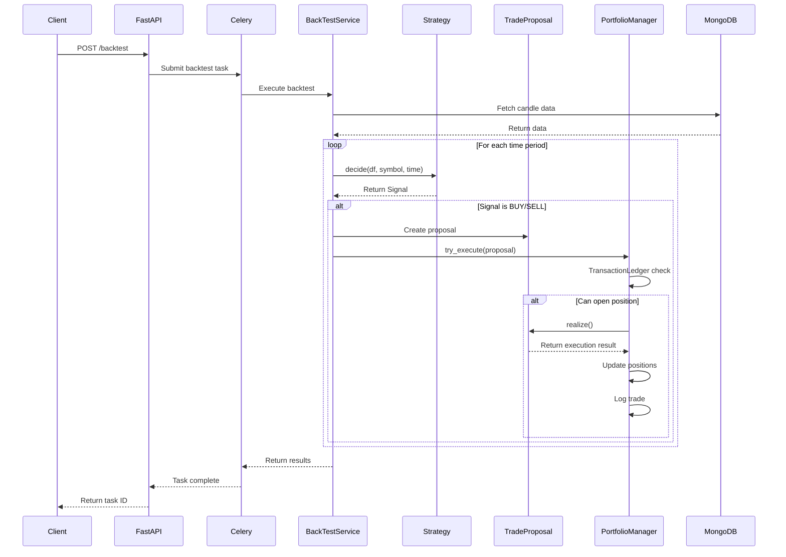
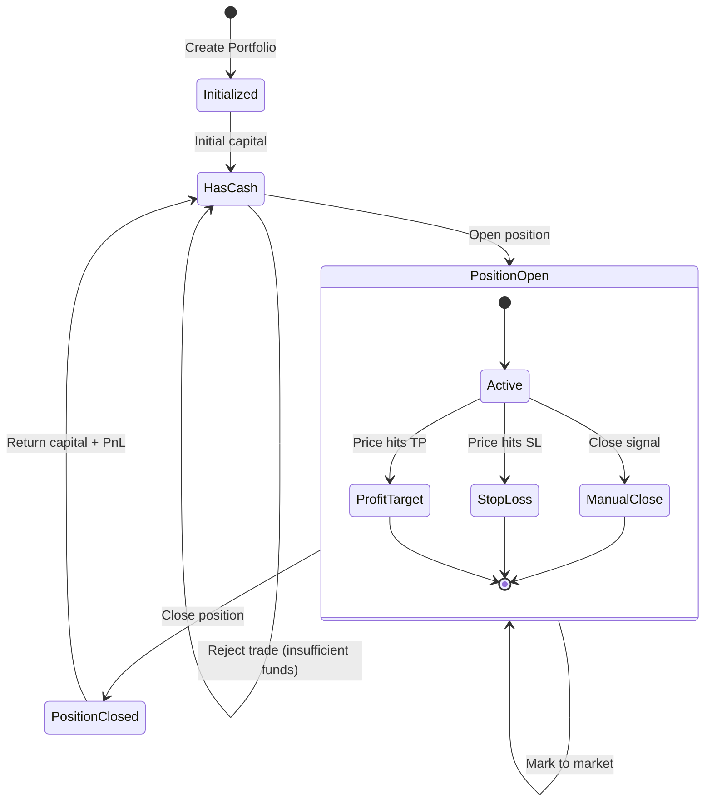
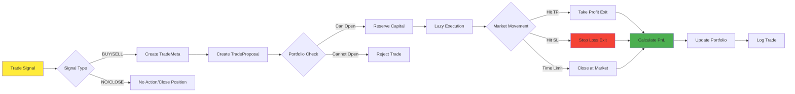
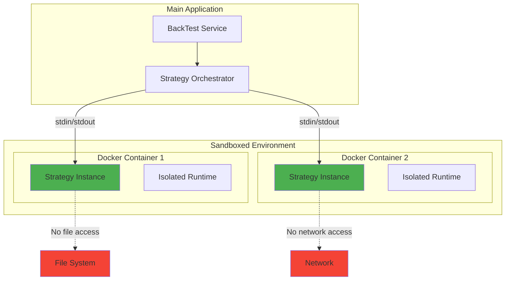
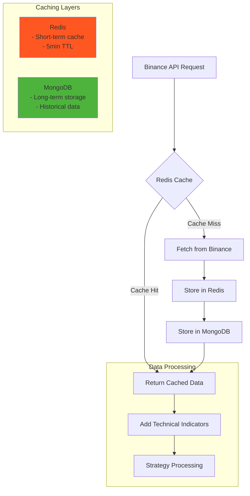

# Binance Trading Bot Architecture Diagrams

이 문서는 Binance Trading Bot의 전체 아키텍처와 entities 폴더의 구조를 시각화한 여러 Mermaid 다이어그램을 포함합니다.

## 1. 전체 시스템 아키텍처



## 2. Entities 폴더 구조



## 3. Strategy 클래스 계층 구조



## 4. 트레이딩 플로우 시퀀스 다이어그램



## 5. Portfolio Manager 상태 관리



## 6. Trade Proposal 실행 플로우



## 7. Strategy Orchestrator 샌드박싱



## 8. 데이터 플로우와 캐싱



## 9. Grid Search 파라미터 최적화

```mermaid
graph TD
    A[Grid Search Request] --> B[Parameter Grid Generation]
    B --> C[Create Parameter Combinations]
    
    C --> D[Parallel Execution]
    
    subgraph "Parallel Backtests"
        D --> E1[Backtest 1<br/>Params: {a:1, b:2}]
        D --> E2[Backtest 2<br/>Params: {a:1, b:3}]
        D --> E3[Backtest 3<br/>Params: {a:2, b:2}]
        D --> EN[Backtest N<br/>Params: {a:n, b:m}]
    end
    
    E1 --> F[Results Collection]
    E2 --> F
    E3 --> F
    EN --> F
    
    F --> G[Performance Comparison]
    G --> H[Best Parameters]
    
    style D fill:#FFC107
    style H fill:#4CAF50
```

## 10. 신호 생성 상세 플로우 (PeakEMAReversalStrategy)

```mermaid
flowchart TD
    A[Start: decide()] --> B[Get Recent Data]
    B --> C{Find Peak<br/>in last N bars}
    
    C -->|No Peak| D[Return 'NO' Signal]
    C -->|Peak Found| E[Check Bearish Pattern<br/>After Peak]
    
    E -->|No Pattern| D
    E -->|Pattern Found| F[Calculate EMAs]
    
    F --> G{Price < Fast EMA<br/>< Slow EMA?}
    
    G -->|No| D
    G -->|Yes| H[Generate BUY Signal]
    
    H --> I[Set Entry Price]
    I --> J[Calculate TP<br/>Entry × (1 + tp_pct)]
    J --> K[Calculate SL<br/>Entry × (1 - sl_pct)]
    K --> L[Return Signal with<br/>TradeMeta]
    
    style A fill:#2196F3
    style H fill:#4CAF50
    style L fill:#4CAF50
    style D fill:#F44336
```

## 주요 특징

1. **모듈화된 구조**: 각 컴포넌트가 명확히 분리되어 있어 유지보수와 확장이 용이
2. **비동기 처리**: Celery를 통한 백그라운드 작업 처리로 시스템 응답성 향상
3. **샌드박싱**: Docker 컨테이너를 통한 전략 실행 격리로 보안성 강화
4. **확장 가능한 전략 시스템**: 추상 클래스를 통한 새로운 전략 추가 용이
5. **다층 캐싱**: Redis와 MongoDB를 활용한 효율적인 데이터 관리
6. **리스크 관리**: Portfolio Manager를 통한 포지션 크기 및 자금 관리
